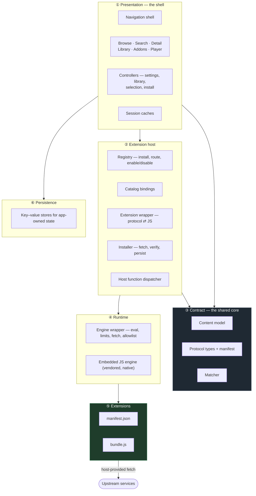
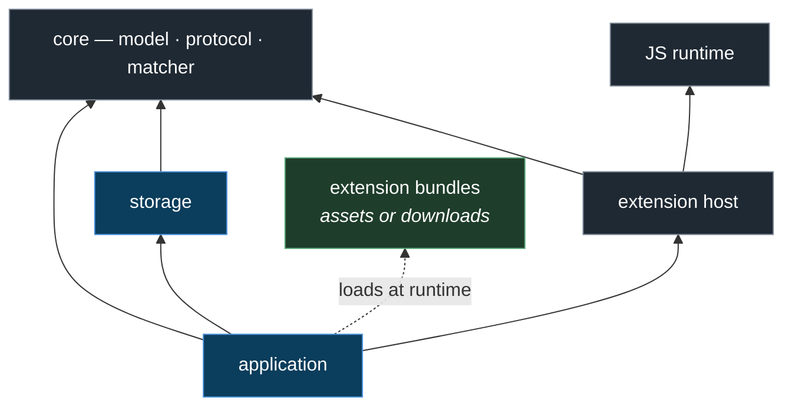
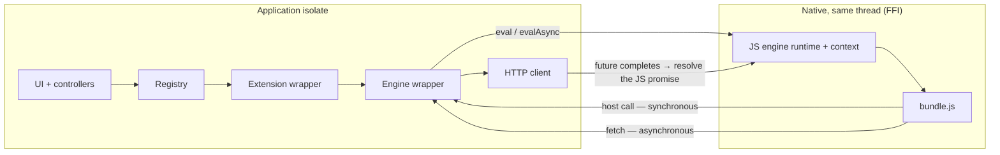
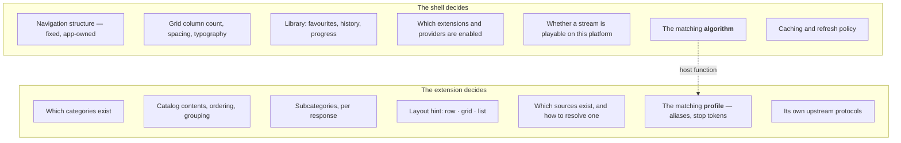
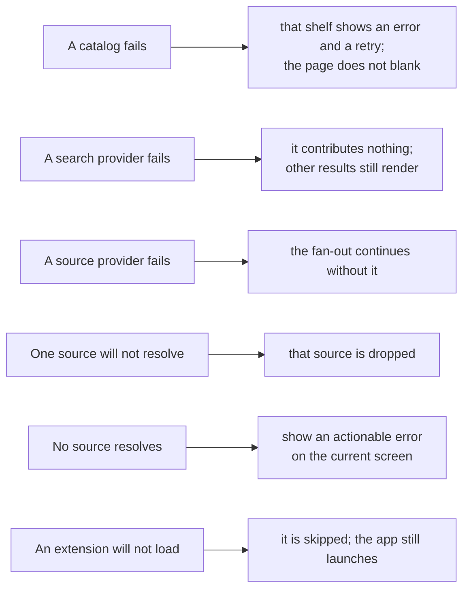

# 1. Architecture

## 1.1 Design constraints

Five rules shape every boundary in the system:

1. **Extension-first.** Content and provider-specific logic live in extensions. The
   application binary contains only shared models and behavior.
2. **One protocol, no privileged path.** Bundled and downloaded extensions use the same
   loading path.
   If a first-party extension cannot operate through the public API, the API is incomplete.
3. **JSON-only boundary.** Everything crossing the extension boundary is JSON-compatible.
   No domain object, no URI type, no date type, no enum crosses unserialized.
4. **Discovery is separate from resolution.** Listing sources is cheap and cacheable;
   resolving one produces a signed, short-lived URL that must never be treated as durable
   content data.
5. **Lazy boundaries.** Add a package or abstraction when an existing use case requires it.

## 1.2 Layers

**Dependencies point downward.** The contract layer only uses value-type utilities. The
extension host has no UI framework dependency, which keeps routing, installation, and
protocol handling testable without a device. Types shared by the host and persistence layer
belong in the contract layer.

## 1.3 Responsibilities

| Layer | Owns | Never contains |
|---|---|---|
| **Presentation** | Navigation, screens, playback, user-facing state | Any knowledge of a specific upstream |
| **Extension host** | Which extensions exist, routing calls to them, install/verify | Content logic, UI |
| **Contract** | Content model, protocol types, matcher algorithm | Content or provider-specific behavior |
| **Runtime** | Executing untrusted JS under limits; the host function surface | Protocol semantics |
| **Extensions** | Catalogs, metadata, source discovery and resolution | Anything about the user |
| **Persistence** | Library, settings, installed extensions, caches | Any reading of extension-owned data — an extension's own cache is stored as an opaque blob under its id, never interpreted |

## 1.4 Package layout

| Package | UI framework? | Role |
|---|---|---|
| core | no | Content model, protocol types, manifest parsing, matcher. The contract everything shares. |
| extension host | no | Registry, routing, the protocol⇄JS wrapper, host functions, installer. |
| JS runtime | no (FFI) | The embedded engine: eval, resource limits, `fetch`, host-callback bridge. |
| storage | yes | Key–value persistence for app-owned state. |
| application | yes | Shell, screens, controllers, caches, player. |

The workspace resolves as a single unit — one dependency resolution, one lockfile — so a
change to the contract is compiled against every consumer at once.

## 1.5 Runtime topology

Everything runs on **one isolate/thread**. There is no worker thread and no separate JS
thread.

Runtime behavior:

- **Asynchrony in JS is host asynchrony.** A `fetch` from JS becomes an ordinary host
  future, interleaved with synchronous native calls on the same isolate. The JS engine
  itself stays single-threaded.
- **Concurrent role calls are supported.** Several calls may be in flight; they interleave
  on one shared JS event loop, the way concurrent work in a browser does. A fan-out across
  providers needs **one engine instance**, not one per call.
- **One engine per extension.** Each installed extension gets its own engine, created with
  its own host allowlist. Extensions therefore cannot see each other's globals.
- **Scripts within one extension share global scope.** That is what lets a bundle carrying
  several providers coordinate — see
  [Extension Protocol §2.7](02-extension-protocol.md#27-one-bundle-many-providers).

## 1.6 Who decides what

Matching a catalog item to a source must be consistent across extensions. The host provides
the algorithm, while extensions provide aliases and normalization rules as data.

## 1.7 Failure model

Failures are isolated to the smallest affected unit.

A failure is contained to its own scope. Empty results are reported instead of leaving a
loading state active.

## 1.8 Non-goals

| Not built | Reason |
|---|---|
| A backend | Extensions execute on-device, so requests carry the user's own IP — required for IP-bound signed URLs and region-locked streams. A server route would break both. |
| A capability object layer (`stream` / `download` / `children`) | The current protocol has one active capability. Add the layer when another capability is implemented. |
| Realtime push (WebSocket/SSE) | No current feature requires it. |
| Content-specific types in the core | These types belong in extensions. |
