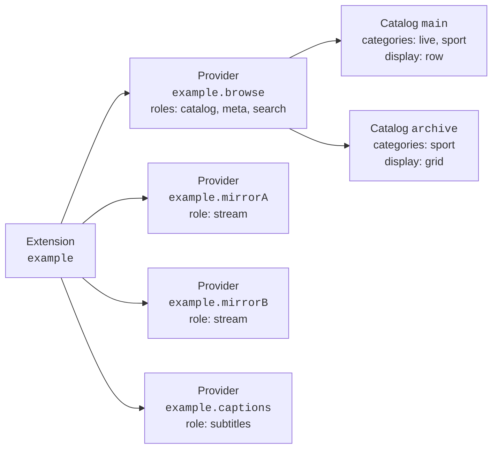
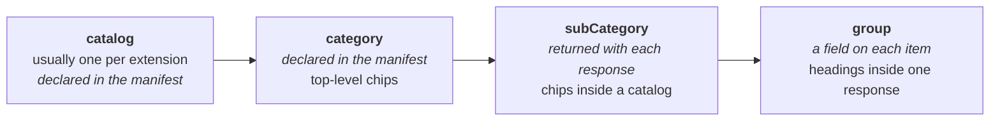
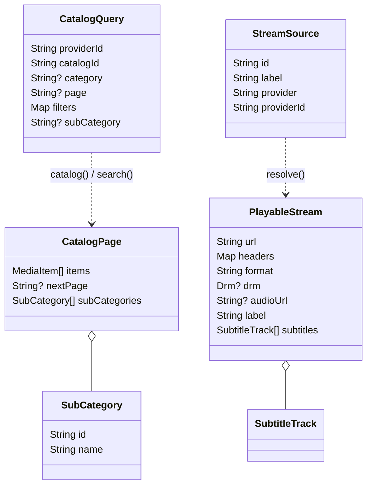
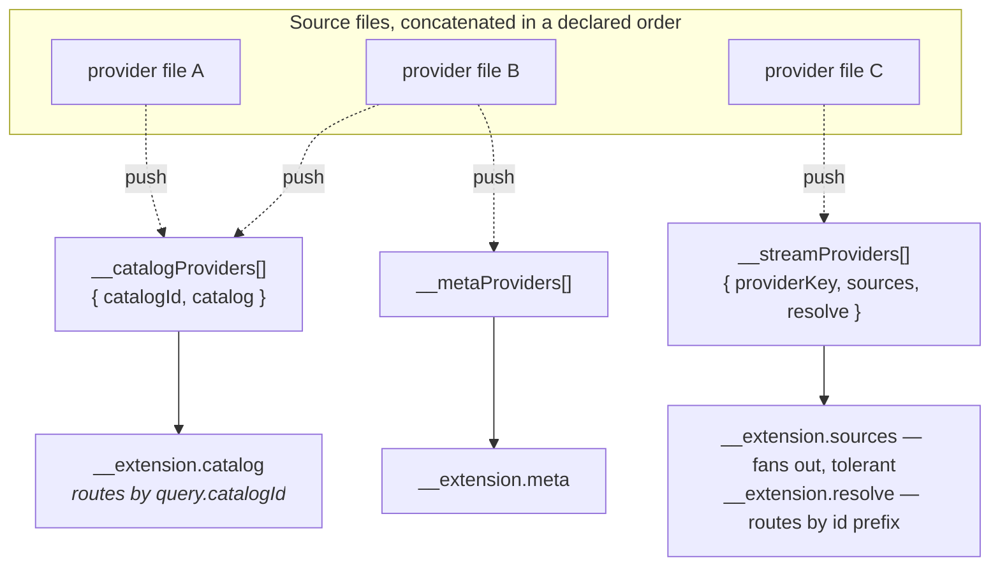

# 2. Extension Protocol

The extension protocol uses a **JSON-only boundary**. The host and extension exchange
serialized values.

## 2.1 Shape of an extension

An **extension** declares one or more **providers**. Each provider fills one or more
**roles**. A provider with the `catalog` role also declares the **catalogs** it serves.



Each provider is independently switchable. An extension can remain enabled while one of
its stream providers is disabled.

Providers that operate as one feature belong in the same extension, even when they use
different upstream services.

## 2.2 Roles

| Role | Called as | Returns | Purpose |
|---|---|---|---|
| `catalog` | `catalog(query)` | a page of items | Content lists. |
| `meta` | `meta({ ref })` | one item's detail | Synopsis, cast, seasons/episodes. |
| `stream` | `sources({ item, enabledProviders })` | a list of source descriptors | **Cheap** discovery. |
| | `resolve({ sourceId })` | one playable stream | **Expensive**, short-lived. |
| `search` | `search({ query, page, category })` | a page of items | Free-text search, optionally scoped to one category. |
| `subtitles` | `subtitles({ item })` | a list of subtitle tracks | Lookup independent of any source. |

A role the manifest does not declare is **never invoked**. The host checks the manifest
before routing, so an extension only implements what it declares.

### `sources` input

A stream provider often has to *match* a catalog item against its own listing — by title,
by participants, by start time. The caller already holds the item; re-deriving it from an
opaque id would cost a pointless second fetch, and when the source comes from a different
service than the catalog, it is not even possible.

### Discovery and resolution

Source **lists** are cheap, stable, and worth caching. Resolved **URLs** are typically
signed, time-limited, and often bound to the requesting IP — they must be fetched close to
playback and must never be treated as durable data.

## 2.3 Manifest

An extension is two files: `manifest.json` and `bundle.js`. The manifest is the authority.

```json
{
  "apiVersion": 1,
  "id": "example",
  "name": "Example",
  "version": "1.0.0",
  "runtime": "js",
  "entry": "bundle.js",

  "description": "Optional — shown on the install prompt.",
  "author": "Optional — a label, not verified provenance.",
  "iconUrl": "https://cdn.example.com/icon.png",
  "contentRating": "general",

  "categories": ["live", "sport"],

  "providers": [
    {
      "id": "example.browse",
      "roles": ["catalog", "meta", "search"],
      "searchCategories": ["live"],
      "catalogs": [
        {
          "id": "main",
          "name": "Example",
          "categories": ["live", "sport"],
          "kind": "liveEvent",
          "display": "row",
          "filters": ["date"]
        }
      ]
    },
    { "id": "example.mirrorA", "name": "Atlas", "roles": ["stream"] },
    { "id": "example.mirrorB", "name": "Boreal", "roles": ["stream"] }
  ],

  "permissions": {
    "hosts": ["api.example.com", "*.cdn.example.com"]
  }
}
```

| Field | Rule |
|---|---|
| `apiVersion` | Checked at parse time. A manifest newer than the running build is **refused**, not partially loaded. |
| `id` | Namespaces everything the extension owns. Provider ids conventionally prefix it. |
| `entry` | Names the bundle file. The loader reads this — it knows nothing extension-specific. |
| `categories` | The union of what the catalogs declare. These become the shell's top-level chips. |
| `providers[].name` | Optional user-facing provider name. Keep `id` stable for routing and saved settings; use `name` when the upstream identity should not be displayed. |
| `providers[].searchCategories` | Optional. The categories a scoped search may route to this provider. Omit it when the provider also serves catalogs: the host derives the list from them. Declare it for a **search-only** provider, which has no catalog to derive from. |
| `permissions.hosts` | **Enforced on every network call**, and shown to the user before install. Not documentation. A bare `*` entry opts out of the allowlist entirely and is surfaced to the user as unrestricted access. |
| `description`, `author`, `iconUrl` | Optional and additive, so older manifests still parse and older builds ignore what they do not know. `author` is asserted by the manifest about itself and verified by nothing — it is a label. |
| `contentRating` | Optional `general`, `mature`, or `unknown` audience label. It is the default for the extension's catalogs and is self-declared, not a security guarantee. |

### Search scopes

Search is unscoped by default and fans out to every extension declaring the `search` role.
The user can narrow it to one category, and the host then asks **only** the extensions
whose searchable categories include it, passing that category down as `category`.

The scope chips are not configured anywhere — they are the union of what installed
extensions declare, exactly as Home's category chips are. Serving a new vertical is
therefore an install, not an app release. `all` is never a scope: it is Home's
"everything" chip, and an unscoped search already means that.

An extension that fans out internally routes on `category`, and **must** treat its absence
as the unscoped search it always performed — an older host sends no such field, and a
bundle that mistakes absence for "no provider selected" goes silent on it.

### The manifest is not read from the bundle

The manifest is parsed from its own file and handed to the loader **before any bundle code
runs**, so the network allowlist is derived from declared permissions rather than from
anything the bundle says about itself. **A bundle can never widen its own permissions.**

## 2.4 Catalog taxonomy

A **catalog is the root** of everything a provider serves — not a slice of a taxonomy. The
taxonomy lives *inside* it and narrows left to right:



| Level | Declared where | Interpreted by the shell? | Rendered as |
|---|---|---|---|
| catalog | manifest | no | one shelf, or one full screen |
| category | manifest, as a **list** | no | top-level chips |
| subCategory | **response** | no — ids are opaque and echoed back | chips, or sections on the browse screen |
| group | a field on each item | no | headings within one list |

`contentRating` may be declared on a catalog to override the manifest default. A catalog
marked `mature` is hidden when the user disables the app's **Show NSFW content** setting.
For a mixed catalog, use separate catalogs until the protocol gains item-level audience
metadata. The rating is a filter hint supplied by the extension, not content inspection.

**`categories` is a list, not a single value.** One catalog legitimately spans several, and
the same item may surface under more than one. Which one the user is browsing arrives with
the query, so the extension answers per-category from one catalog instead of declaring a
near-duplicate catalog for each.

**Subcategories are returned, not declared.** What a catalog divides into is often a
property of *today's data*, not of the extension. A manifest-declared list would show empty
divisions and miss new ones until the extension was reinstalled. So the extension returns
whatever is available at fetch time, and the shell renders that. A fixed taxonomy is the
special case where the returned list never changes.

They come back on **every** response — narrowed or not — so the chips stay on screen while
the user moves between them rather than vanishing the moment one is picked. The leading
"All" chip is the shell's own and needs no declaration: it means "no narrowing", which is
the query the extension already answers when no subcategory is given.

**A group is a heading you scroll past; a subcategory is a narrowing you fetch.** An
extension may use either, both, or neither. Items are expected to arrive already ordered
with each group contiguous — the shell starts a new heading whenever the value changes and
never re-sorts, because only the extension knows what order its groups belong in.

### Layout hint

Only the extension knows whether its catalog is a curated shelf or a long list to scan:

| `display` | Shape | For |
|---|---|---|
| `row` | horizontal carousel | short curated shelves |
| `grid` | vertical grid, everything visible | long lists worth scanning |
| `list` | single column | items needing full width to read |

The value describes layout shape, not dimensions. The shell controls column count, cell
size, and row height. `list` uses one column.

## 2.5 Call and response shapes



Full field-by-field definitions are in [Data Model](05-data-model.md). Two serialization
rules are load-bearing:

- **Item kind decodes strictly.** An unrecognized kind is a genuine incompatibility that
  `apiVersion` exists to catch, not something to coerce into a default.
- **Everything else decodes leniently.** An unrecognized status, container format, or DRM
  scheme falls back to a defined "unknown" value, so a newer extension degrades instead of
  failing.

`nextPage` is an **opaque cursor**. The shell stores it and hands it back; it never parses
it. Return nothing when there is no further page.

## 2.6 Source ids

A source id must be **self-contained**. `resolve()` receives the id and nothing else — no
item, no session, no server-side handle — so resolution is stateless and a cached source
list survives a restart.

```
<providerKey>:<opaque payload>
```

- The prefix routes the call to the right provider inside the bundle.
- The payload is whatever that provider needs, encoded however it likes (a compact
  base64url-encoded JSON object is the usual choice).
- **Anything `resolve()` will need must be baked in at `sources()` time** — including
  identifiers needed for a follow-up lookup such as subtitles.

## 2.7 One bundle, many providers

After evaluation, a bundle must expose `globalThis.__extension` as an object containing the
role functions declared by the manifest. The host validates this object when the bundle
loads.

The registration pattern below prevents provider files from overwriting each other:



Each file **pushes itself onto a registry array** and then installs the shared dispatcher
**only if it is not already there**. Whichever file loads first installs it; the rest just
register. Nothing is overwritten, and files can be added or reordered freely.

```js
// Register, don't assign.
globalThis.__streamProviders = globalThis.__streamProviders || [];
globalThis.__streamProviders.push({
  providerKey: 'mirrorA',
  sources: mirrorASources,
  resolve: (sourceId) => mirrorAResolve(sourceId),
});

// Install the shared dispatcher once, idempotently.
globalThis.__extension = globalThis.__extension || {};
if (!globalThis.__extension.sources) {
  globalThis.__extension.sources = async (args) => {
    const perProvider = await Promise.all(
      globalThis.__streamProviders.map((p) =>
        p.sources(args).catch(() => ({ sources: [] })),  // one failure ≠ all failures
      ),
    );
    return { sources: perProvider.flatMap((r) => r.sources) };
  };

  globalThis.__extension.resolve = async ({ sourceId }) => {
    const i = sourceId.indexOf(':');
    if (i < 0) throw new Error(`Malformed source id: ${sourceId}`);
    const key = sourceId.slice(0, i);
    const provider = globalThis.__streamProviders.find((p) => p.providerKey === key);
    if (!provider) throw new Error(`No stream provider registered for "${key}"`);
    return provider.resolve(sourceId);
  };
}
```

Note the `.catch(() => ({ sources: [] }))`. **A provider that throws contributes nothing
and must not fail the whole call** — that tolerance is what keeps one broken upstream from
emptying a detail page.

### Respecting the user's toggles

`sources()` receives `enabledProviders`: the full ids of this extension's own stream
providers that are currently switched on. An extension that fans out internally must filter
its fan-out by that set. An extension with a single, non-toggleable stream provider can
ignore it.

## 2.8 Checklist for a new provider

1. Write the provider file; register it into the appropriate registry array.
2. Give it a unique `providerKey` and prefix every source id with it.
3. Declare the provider — and its catalogs, if any — in `manifest.json`.
4. Declare **every host it touches**, including redirect targets, under
   `permissions.hosts`.
5. Add the file to the bundler's source list, respecting dependency order.
6. Regenerate the bundle.
7. Test it against a local fixture server, through a real engine — not a mock.
