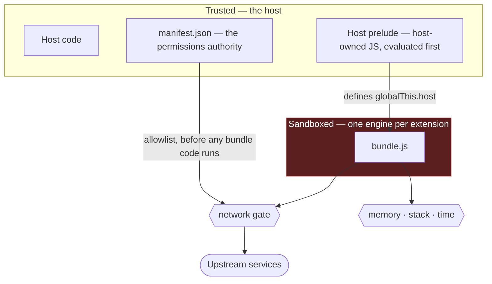
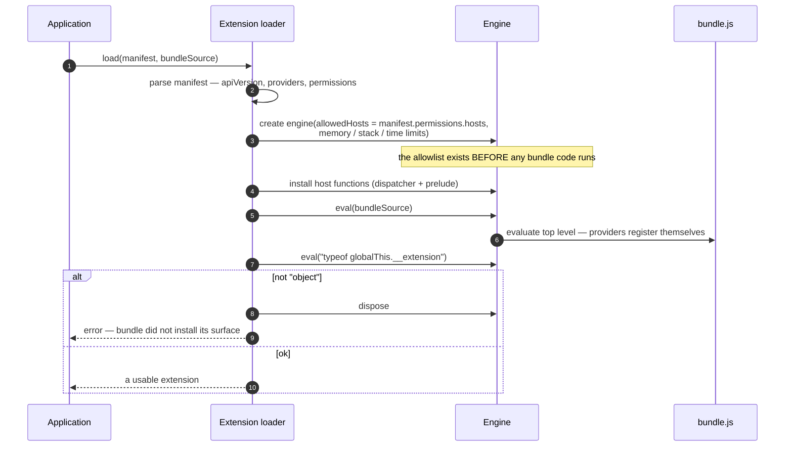
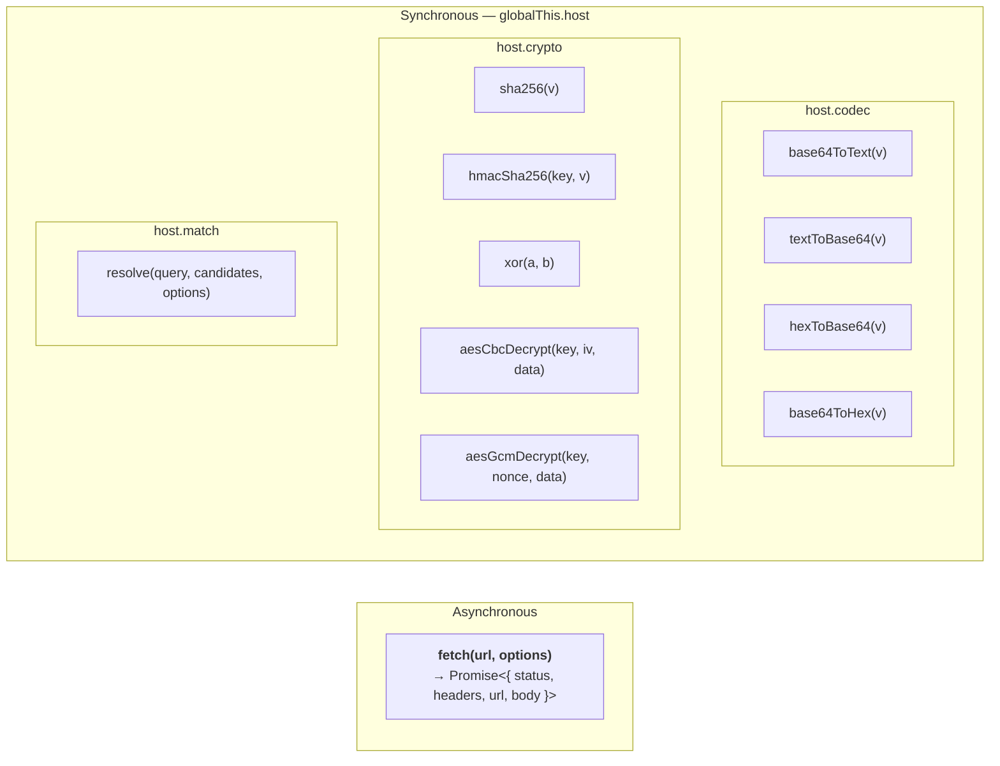
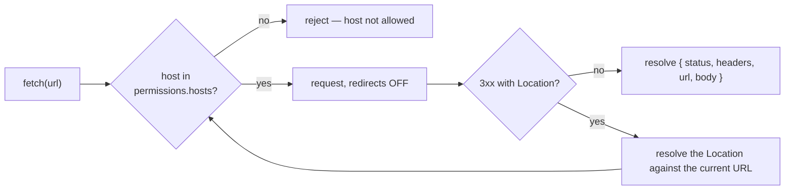
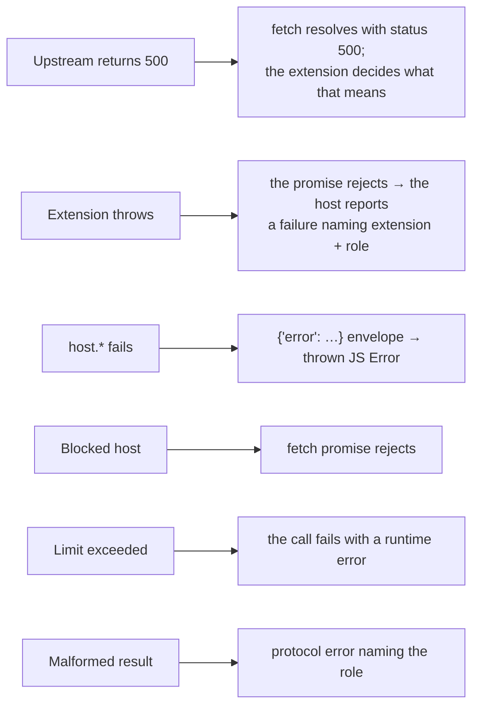

# 3. The JS Bridge

This document defines the trust boundary, communication channels, request and response
formats, and JavaScript host functions.

## 3.1 The trust boundary



The embedded engine has **no ambient authority**. It has no filesystem, network, process,
DOM, timers, or crypto unless the host exposes them. Memory and CPU usage are bounded.

Concretely, the engine installs precisely **two** globals of its own — `fetch` and
`__host_call` — and then evaluates a host-owned prelude that turns `__host_call` into the
friendlier `globalThis.host` namespace. Everything else in scope is standard ECMAScript.

## 3.2 Engine lifecycle



Ordering is the security property here: permissions are derived from the manifest, the host
API is installed, and only then does untrusted code run. A bundle can never widen its own
permissions, and cannot replace a host function before the host has defined it.

Each extension gets **its own engine**, so extensions cannot see each other's globals.
Disposing an extension frees the underlying native runtime; the caller that created it owns
disposing it, including when an update replaces an installed extension in place.

## 3.3 The four channels

```mermaid
sequenceDiagram
    autonumber
    participant D as Host
    participant N as Native shim
    participant Q as JS engine
    participant J as bundle.js

    rect rgb(30,40,50)
    Note over D,J: ① Synchronous eval — host calls into JS
    D->>N: eval(code)
    N->>Q: evaluate as a global script
    Q->>J: run
    J-->>Q: value
    Q-->>N: JSON.stringify(value), or String(value) when JSON cannot represent it
    N-->>D: string (host frees it)
    end

    rect rgb(30,50,40)
    Note over D,J: ② Asynchronous eval — host awaits a JS promise
    D->>N: evalAsync(code) → "pending", evalId
    J-->>Q: (later) promise settles
    D->>N: drain completions
    N-->>D: evalId + result | error → the awaiting future completes
    end

    rect rgb(50,40,30)
    Note over D,J: ③ Host call — JS calls into the host, synchronously
    J->>N: __host_call(name, argsJson)
    N->>D: dispatch(name, argsJson)
    D-->>J: JSON envelope — {"value": …} or {"error": …}
    end

    rect rgb(45,30,50)
    Note over D,J: ④ fetch — JS calls into the host, asynchronously
    J->>N: fetch(url, options) → Promise
    N->>D: start request (requestId)
    D->>D: perform HTTP, hop by hop
    D->>N: resolve/reject requestId
    N->>Q: settle the promise, run its reaction jobs
    end
```



### ① and ② — how the host invokes a role

A role call is built as a **JSON literal embedded in a one-line script**:

```js
globalThis.__extension.<role>({ …arguments… })
```

The arguments are serialized by the host and inlined as a literal — **never** as a string
the bundle has to parse itself. Nothing in a query can therefore be interpreted as code.

The result must be a JSON **object**. Anything else — malformed JSON, a bare array, a
rejected promise, a thrown error — surfaces to the application as a single, named failure
identifying the extension and the role.

Because roles are `async`, the host uses channel ② for them. Several may be in flight at
once; they interleave on one shared JS event loop. A fan-out across providers therefore
needs **one engine**, not one per call.

> Scripts evaluated this way are global-scope scripts. Bare top-level `await` outside a
> function is not supported — wrap async work in an async function or an async IIFE, which
> is what the role functions already are.

### ③ — how JS calls the host

`__host_call(name, argsJson)` is synchronous, runs on the same call stack, and returns a
string. Everything in the `host.*` namespace is a thin wrapper over it.

Failures travel **inside** the returned JSON as `{"error": "…"}` rather than as a native
exception, because the callback boundary cannot carry an exceptional return. The prelude
converts that envelope back into a thrown JS `Error`, so from the bundle's point of view it
reads as an ordinary exception:

```js
function call(name, args) {
  const result = JSON.parse(__host_call(name, JSON.stringify(args)));
  if (result.error !== undefined) throw new Error(name + ': ' + result.error);
  return result.value;
}
```

### ④ — how JS reaches the network

`fetch` is the only way out of the sandbox. It returns a real `Promise`, but the asynchrony
is the host's: the request becomes an ordinary host future on the same isolate, and its
completion settles the JS promise. The JS engine never runs on another thread.

## 3.4 Role call reference

Every argument and every result below is plain JSON.

| Role | Host sends | Extension returns |
|---|---|---|
| `catalog` | `{ providerId, catalogId, category?, page?, filters?, subCategory? }` | `{ items: [...], nextPage?, subCategories?: [...] }` |
| `search` | `{ query, page?, category? }` | `{ items: [...], nextPage?, subCategories?: [...] }` |
| `meta` | `{ ref: { extensionId, providerId, id } }` | `{ item, description?, genres?, runtimeMinutes?, certification?, cast?, seasons? }` |
| `sources` | `{ item, enabledProviders?: [providerId, …] }` | `{ sources: [ { id, label, provider? }, … ] }` |
| `resolve` | `{ sourceId }` | `{ url, headers?, format?, drm?, audioUrl?, label?, subtitles? }` |
| `subtitles` | `{ item }` | `{ subtitles: [ { language, url, label? }, … ] }` |

Note the two envelope shapes: `catalog`, `search`, `meta`, and `resolve` return the object
**directly**, while `sources` and `subtitles` return a **wrapper** with a single named list.
Returning the wrong shape is reported as a protocol error naming the role.

```js
// The minimum viable extension surface.
globalThis.__extension = {
  async catalog(query) {
    const res = await fetch(`https://api.example.com/list?page=${query.page ?? 1}`);
    if (res.status < 200 || res.status >= 300) {
      throw new Error(`list failed: ${res.status}`);   // becomes a host-side failure
    }
    const data = JSON.parse(res.body);
    return {
      items: data.map(toMediaItem),
      nextPage: data.length ? String(Number(query.page ?? 1) + 1) : undefined,
      subCategories: [{ id: 'featured', name: 'Featured' }],
    };
  },
};
```

## 3.5 Host functions

Everything the sandbox can reach, in full.



### `fetch(url, options)`

```js
const res = await fetch('https://api.example.com/thing', {
  method: 'POST',                        // default "GET"
  headers: { 'User-Agent': '…', Referer: 'https://example.com/' },
  body: 'a=1&b=2',                       // string
});
// res.status   number   — the final response's status
// res.headers  object   — response headers, values joined with ", "
// res.url      string   — the FINAL url, after any redirects
// res.body     string   — the response body as text
```

| Behaviour | Detail |
|---|---|
| Allowlist | Every request is checked against the manifest's `permissions.hosts`. A blocked host **rejects the promise**; it does not silently return an error status. |
| Redirects | **Not followed automatically.** The host follows them itself, one hop at a time, re-checking the allowlist on **every hop**, and reports the final URL. |
| Headers | Arbitrary request headers are honoured, including ones a browser would refuse to let you set. Nothing is auto-populated. |
| Body | Text only. |
| Timeouts | Per-request send and receive timeouts. |
| Status | Any status is returned as data — a `404` resolves the promise with `status: 404`. Only transport failures, timeouts, allowlist rejections, and redirect-limit breaches reject. |
| Concurrency | Multiple in-flight requests are supported, up to a slot limit; exceeding it throws. |

**Set the headers your upstream needs.** Many edges redirect away or reject requests that
lack a `User-Agent` or `Referer`, and the sandbox sends none by default.

### `host.codec` — encoding

Binary is **base64 everywhere** in this API. The bridge carries JSON strings, and a second
binary channel would buy little for primitives called a handful of times per request rather
than per byte. So a "byte string" in extension JS is always base64, and the encode/decode
steps are themselves primitives.

| Function | Takes → returns |
|---|---|
| `base64ToText(b64)` | base64 → UTF-8 decoded string |
| `textToBase64(text)` | string → base64 of its UTF-8 bytes |
| `hexToBase64(hex)` | hex → base64 |
| `base64ToHex(b64)` | base64 → lowercase hex |

Base64 input is **lenient**: whitespace is stripped and padding completed, because upstream
services are frequently careless about both.

UTF-8 decoding is a host primitive rather than JS's own for a specific reason: malformed
input becomes U+FFFD deterministically, never an error and never a lone surrogate. That
makes a decoded string's code units identical on the host and in JS, which is what allows
code-unit-level transforms to be written in JavaScript at all.

### `host.crypto` — primitives

All values in and out are **base64**.

| Function | Notes |
|---|---|
| `sha256(dataB64)` | → digest, base64 |
| `hmacSha256(keyB64, dataB64)` | → MAC, base64 |
| `xor(aB64, bB64)` | Truncates to the **shorter** input — a keystream shorter than its input is a real upstream pattern, not an error. |
| `aesCbcDecrypt(keyB64, ivB64, dataB64)` | PKCS7. Returns **`null`** if the data will not decrypt. |
| `aesGcmDecrypt(keyB64, nonceB64, dataB64)` | 128-bit tag **concatenated onto the end** of the ciphertext. No AAD. Returns **`null`** on tag-verification failure. |

Decryption returns `null` for an invalid key so callers can try another candidate.

### `host.match` — shared matching

Joining a catalog item to a source listing — often from an entirely different service — is
consistency-critical and CPU-bound, so the **algorithm belongs to the host** and no
extension writes its own copy. What the extension supplies is the *vertical knowledge*.

```js
const result = host.match.resolve(
  {
    teamA: 'Example United',
    teamB: 'Example City',
    teamAShort: 'Example Utd',      // optional; scored as an alternative, never a replacement
    teamBShort: 'Example C',
    kickoff: '2026-08-19T18:30:00Z' // ISO-8601 UTC, optional
  },
  [
    { teamA: 'Ex. United', teamB: 'Ex. City', startsAt: '2026-08-19T18:30:00Z' },
    { teamA: 'Other', teamB: 'Team', startsAt: '2026-08-19T20:00:00Z' },
  ],
  {
    profile: {                       // the extension's own vertical knowledge
      aliases: { 'ex utd': 'example united' },
      stopTokens: ['fc', 'cf'],
      ambiguousAlone: ['example'],
    },
    timeWindowMinutes: 45,           // optional override
    minTeamScore: 0.86,              // optional override
  },
);
// → { index: 0, confidence: 0.94 }  |  null
```

The result is an **index into the candidate array**, not the candidate payload. This avoids
serializing extension-owned data through the host.

See [Data Model §5.4](05-data-model.md#54-matching) for the algorithm's invariants.

### APIs not provided

There is no storage, HTML parser, timer, logger, or filesystem. New host APIs require an
implemented use case and fixture coverage.

Practical consequences today: keep state in module scope within a single call chain rather
than expecting it to persist; parse HTML with regular expressions or prefer JSON endpoints;
and do not rely on `setTimeout` — it does not exist.

## 3.6 Resource limits

Applied per engine, at construction:

| Limit | Purpose | On breach |
|---|---|---|
| JS heap | Caps memory a bundle can allocate | The call fails with a runtime error |
| Native stack | Caps recursion depth | The call fails with a runtime error |
| Script time budget | Caps **JS execution** per entry into the engine, via an interrupt | The call fails with a runtime error |
| Fetch timeout | Caps each HTTP request | The `fetch` promise rejects |
| Redirect hops | Caps a redirect chain | The `fetch` promise rejects |
| In-flight fetch slots | Caps concurrent requests | `fetch` throws |

Every limit has a finite default and can be configured by the host.

**The time budget is re-armed each time control enters JS.** A script awaiting a slow
`fetch` is charged for the code it runs, not for the host's round trip — so it is *not* a
bound on total wall-clock time for one role call. Bound network time with the fetch timeout
instead.

Interrupting a *promise-reaction job* aborts the job without rejecting its promise. The host
therefore fails a top-level promise that remains pending after an interrupt.

## 3.7 The network allowlist



- Entries are an **exact host**, a **single-label wildcard** (`*.example.com` matches
  `api.example.com` but neither `example.com` nor `a.b.example.com`), or a bare `*`.
- A bare `*` **allows every host**, disabling the allowlist for that extension. It exists
  for extensions whose stream URLs come from upstream at runtime and therefore cannot be
  enumerated ahead of time. It is a real reduction in isolation — the extension can then
  read any host it can name — so the install prompt spells it out as unrestricted access
  and the user approves it explicitly. Pin hosts wherever they are knowable.
- Matching is on the parsed host, case-insensitive.
- **Every hop is re-checked.** A redirect to an undeclared host is rejected before the next
  request is sent.
- A rejection surfaces in JS as a rejected promise, so an extension can handle or report it.

Declare every host you touch, **including redirect targets**. A chain that lands on an
undeclared host fails at that hop.

## 3.8 Error propagation, end to end



At the application layer each failure is isolated to its affected operation: a failed
catalog costs one shelf, a failed source provider costs that provider's sources, and a
failed resolve costs one source. See [User Journey](04-user-journey.md).

## 3.9 Writing testable extension code

Extension integration tests use the production bridge and runtime:

- Point a real engine at a **local fixture server** serving captured upstream responses.
- Let the base URL be overridable from the outside so the fixture server can stand in for
  production. Treat that as a test seam, not a configuration system.
- Assert on the **exact JSON** a role returns, not on "shape looks right".
- After adding a check, break the thing it protects and confirm the test actually fails,
  then revert. A test that cannot fail is not a test.
