# 4. User Journey

What the user does, and what happens underneath at each step. Every diagram traces a real
path through the system.

## 4.1 The journey at a glance

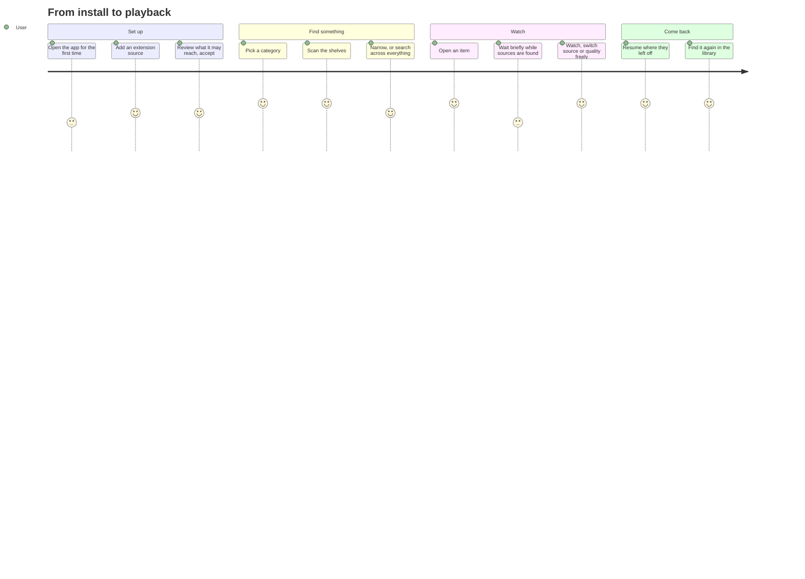

## 4.2 First launch

An installation with no extensions shows an empty state and a link to Addons.

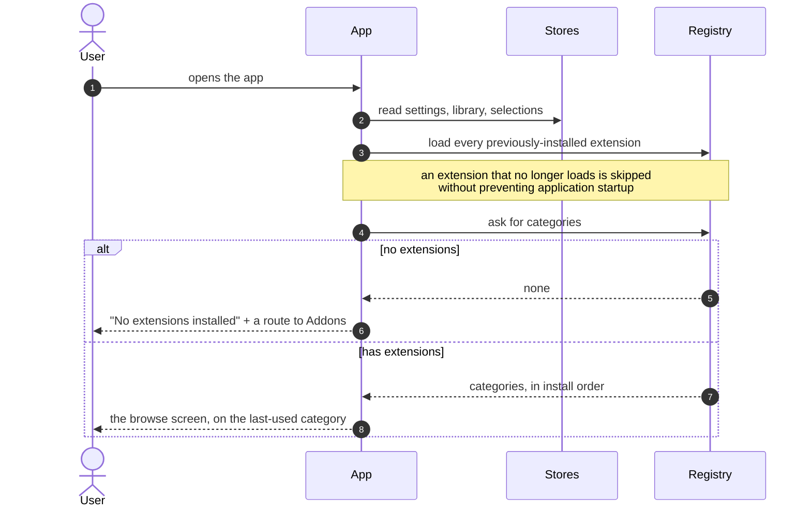

Everything the first frame depends on is read **before** the UI is built, so the app opens
on the user's actual last state rather than picking a default and correcting itself a frame
later.

## 4.3 Adding an extension

```mermaid
sequenceDiagram
    autonumber
    actor U as User
    participant AD as Addons screen
    participant IC as Install controller
    participant N as Extension index
    participant R as Registry

    U->>AD: pastes an index URL, taps Check
    AD->>IC: refresh
    IC->>N: fetch the index
    N-->>IC: list of extensions: id, version, urls, hash, hosts
    IC->>IC: compare against installed versions
    IC-->>AD: rows marked Install or Update

    U->>AD: taps Install or Update
    AD-->>U: version, release notes, and permission changes
    AD->>IC: install
    IC->>IC: which hosts are new versus already granted?
    alt the install would widen access
        IC-->>U: consent sheet — what it may reach, and what is new
        U-->>IC: accept or decline
        Note over IC: declining stops here — nothing is downloaded
    end
    IC->>N: download manifest + bundle
    IC->>IC: verify the bundle against the declared hash;<br/>verify the manifest's id matches
    Note over IC: all-or-nothing — a partially verified download<br/>is never handed onward
    IC->>R: load and register it, live
    IC-->>U: its categories appear immediately — no restart
```

Install behavior:

- **The prompt happens before the download.** Everything the user needs in order to decide
  is readable from the index alone, which is why the index repeats the hosts the manifest
  will declare.
- **Only what actually widens access is highlighted.** Re-listing permissions the user
  already granted trains them to click through; the sheet separates new from already
  granted.
- **Consent defaults to refusal.** If no way to ask exists, the answer is no.

Every update shows its version and release notes before installation. Permission details
highlight only newly requested hosts; previously granted hosts remain visually secondary.

## 4.4 Browsing

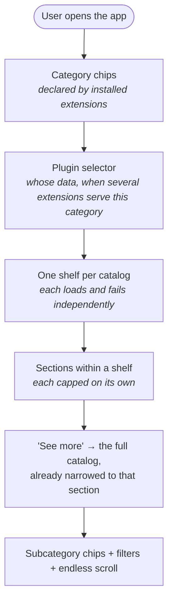

Three narrowings, and **only the first is the shell's**:

| Level | Chosen by | Behaviour |
|---|---|---|
| Category | the user, from chips the extensions declare | There is no shell-invented "All" chip and no "featured" flag. An extension wanting a curated front page declares its own category, and it lands first. |
| Subcategory | the user, from chips the extension **returned** | Ids are opaque and echoed straight back. The list arrives with every response, so the chips stay put while the user moves between them. |
| Group | the extension | Headings inside one response. Shown on the full screen, hidden in previews where a handful of items across as many groups would be mostly headings. |

Sections are capped independently so each section remains visible in previews.

Each shelf loads independently. A failed catalog shows an error and retry action in its own
shelf.

### What the user does not see

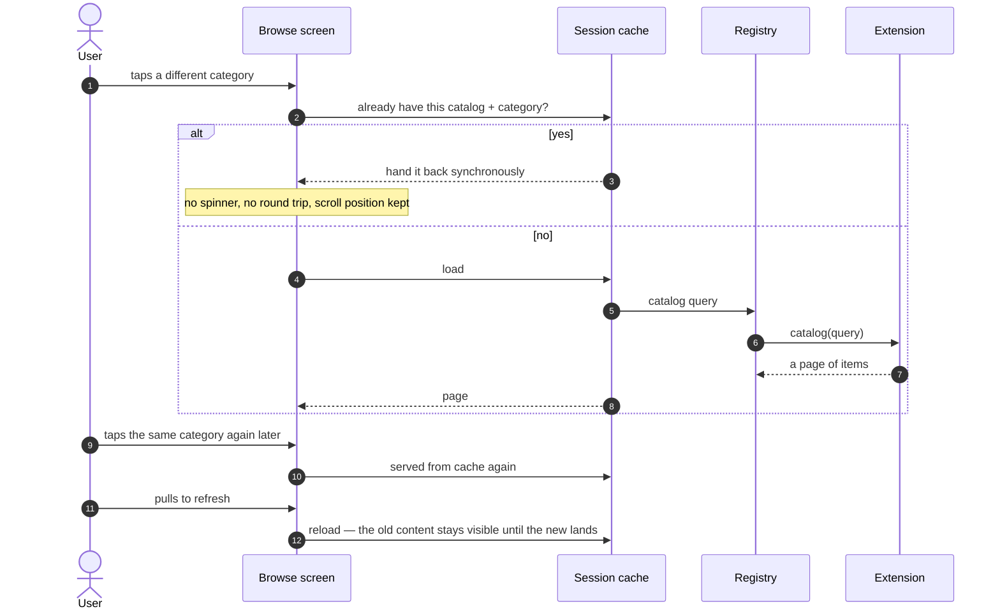

Switching category never refetches. **Asking for fresh data is something the user does**, not
a side effect of navigating — and while a refresh runs, what is already on screen stays on
screen instead of blanking.

## 4.5 Searching

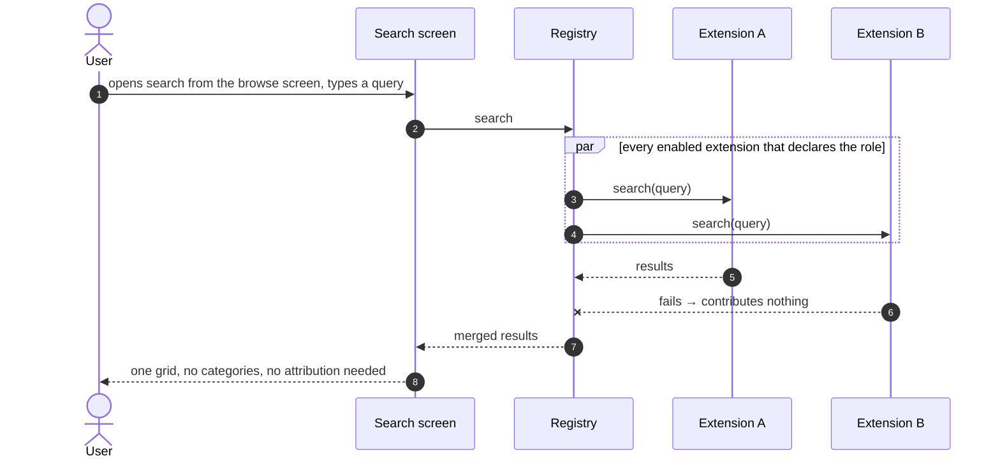

Search is reached from a field at the top of the browse screen, **not** from the navigation
bar. Search spans every extension without applying the selected category, while
browsing shows *one* extension's take on *one* category. Answering both on the same screen
produces a result set whose extent contradicts the chips above it.

## 4.6 Opening an item

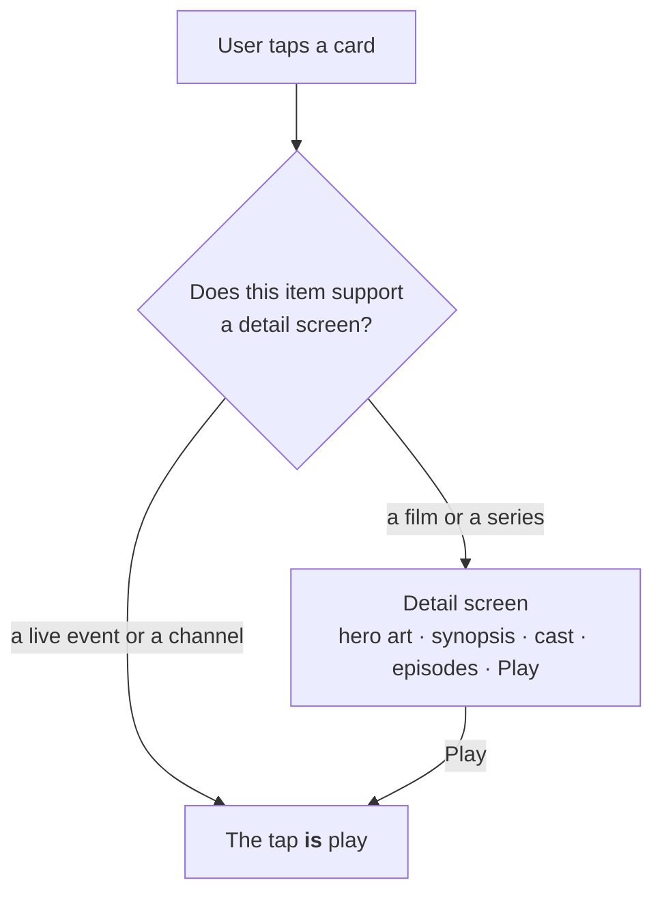

Long-form content opens a detail screen, and source discovery is deferred until the user
selects Play. Live events and channels start the playback flow directly.

### On the detail screen

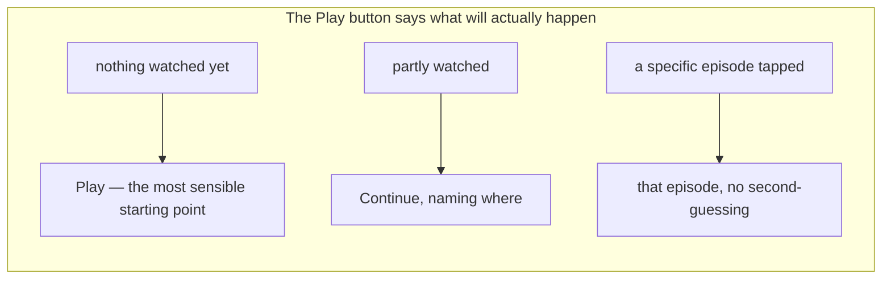

For episodic content the shell's own best guess (from catalog metadata) is confirmed against
what is actually available before playing, so a viewer is never dropped onto something that
has not been released yet. A viewer who taps a *specific* episode is never second-guessed —
that tap already is their answer.

## 4.7 Play

Playback follows this sequence:

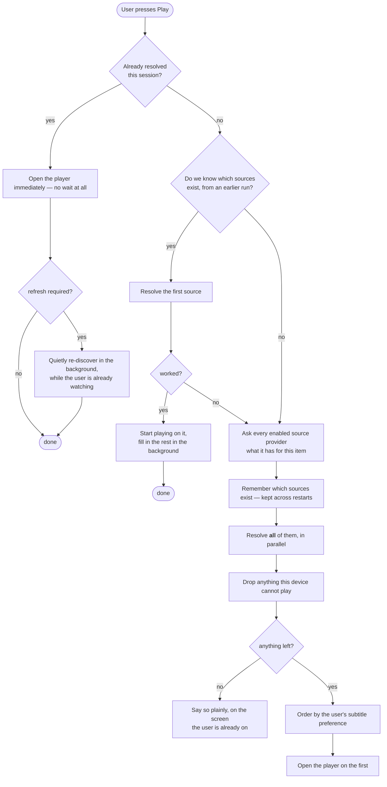

### Play overlay

Pressing Play is **one action**. A titled page that exists only to hold a spinner turns it
into two: somewhere the back button can land, and something that flashes past on a fast
connection. It also has nothing to show — the item is already on screen behind it. So the
wait is an overlay over what the user was already looking at, and backing out of it is
treated as a change of mind, not as a request to be dropped into a player once the network
finally answers.

### Source resolution before playback

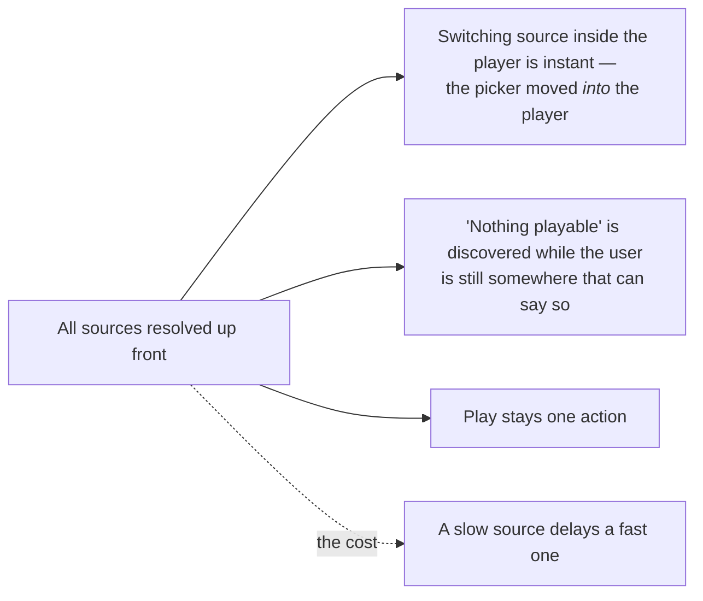

The trade is accepted knowingly: with a handful of sources per item it buys more than it
costs.

### Honest capability handling

An unplayable stream produces an explicit message, never an endless spinner. Capability is
listed **positively** per platform, so a newly-encountered format or protection scheme is
never silently assumed playable — it is dropped, and if nothing survives, the user is told.

## 4.8 Watching

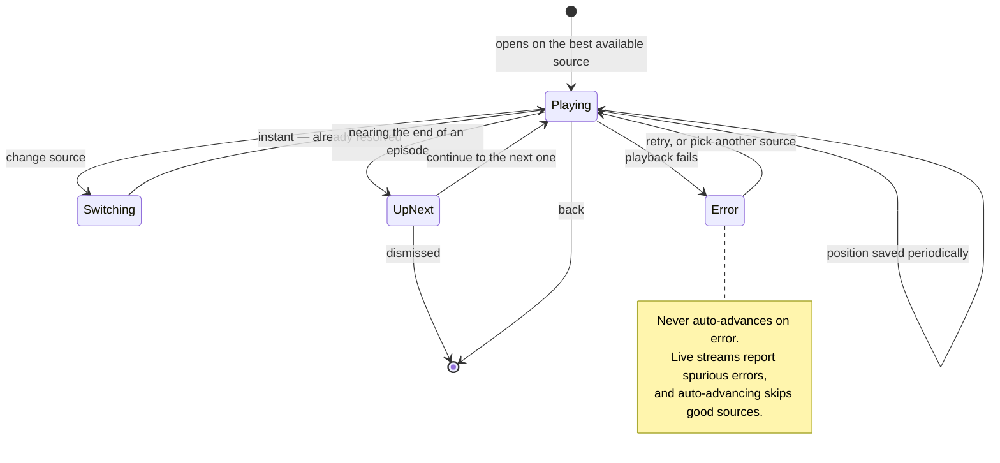

| Behaviour | Reason |
|---|---|
| The source picker lives in the player | Everything is pre-resolved, so switching is instant. Standing between the viewer and playback would waste that. |
| Quality options collapse to one row per resolution | The choice offered is "which resolution", not "which encode". |
| Continuing an episode replaces the player rather than stacking one | A binge session leaves one screen to back out of, not twenty. |
| Progress is saved periodically | Force-quitting loses seconds, not the session. |
| A position very near the start or the end does not resume | Resuming three seconds in reads as "start over"; resuming past the last frame is a trap. |

## 4.9 Coming back

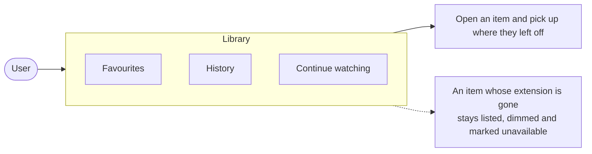

The library is application-owned state. Removing an extension does not delete its history;
affected records remain marked as unavailable.

## 4.10 Managing extensions

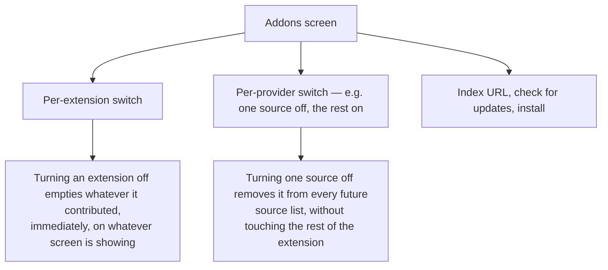

Extension-level and provider-level switches are **independent**: an extension can stay on
with one of its sources disabled. Enabling it again restores the previous configuration.
The disabled state is stored by id and retained across updates.

The index URL is retained across launches. If it is available, the app checks it in the
background at startup, so each installed extension card can show `Up to date` or an `Update`
action before the user opens the repository section.

## 4.11 What the user never has to think about

| Hidden work | Effect they notice |
|---|---|
| Session caching of catalog responses | Switching category is instant |
| Persisting which sources exist for an item | A cold start goes straight to playing |
| Background re-discovery after a cached hit | Links stay fresh without a wait |
| Per-provider failure tolerance | One broken upstream never empties a screen |
| Capability filtering before the player opens | No player that opens onto a dead stream |
| Ordering sources by subtitle preference | The first source played is usually the readable one |
