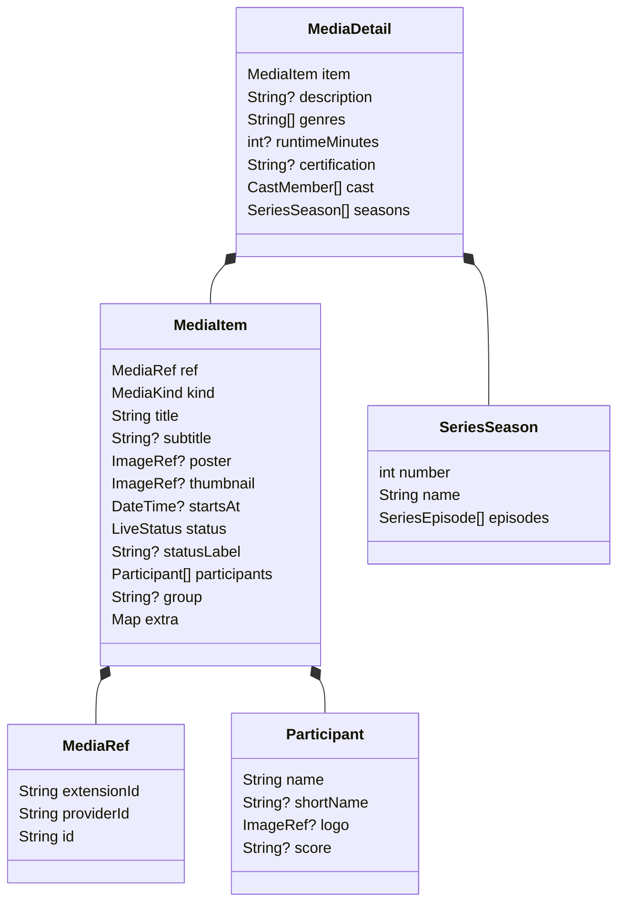
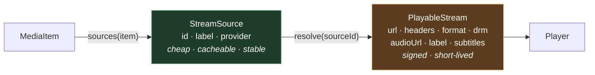
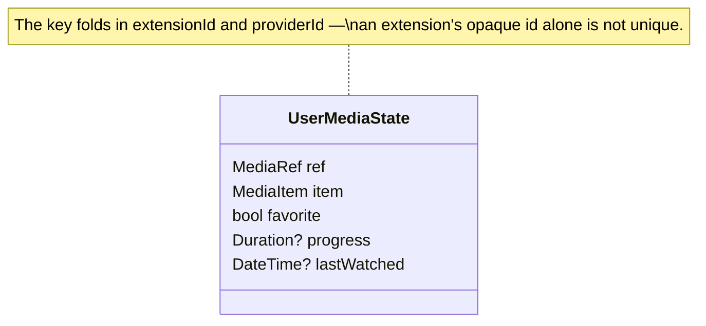
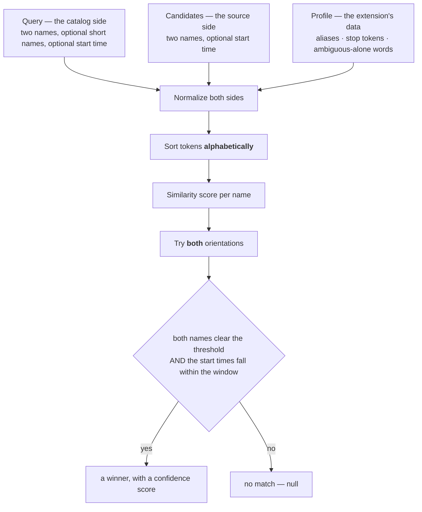
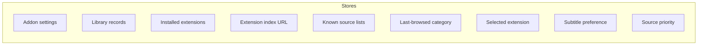
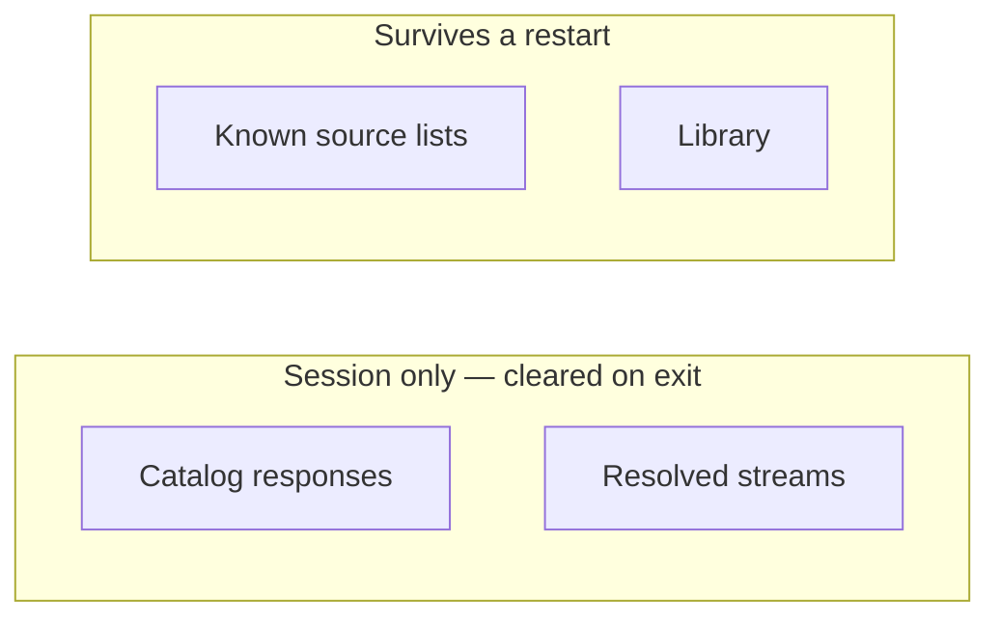

# 5. Data Model

All values cross the extension boundary as JSON. These types define the shared data model
used by the application and extensions.

## 5.1 The content item

`MediaItem` represents every catalog entry. The application renders its declared fields
without interpreting provider-specific meaning.

### Field rules that are load-bearing

| Rule | Reason |
|---|---|
| `id` is **opaque and owned by the extension** | The shell stores and returns it, never parses it. Uniqueness is only guaranteed within an extension, which is why references carry `extensionId` and `providerId` too. |
| `score` is a **string**, never parsed | `"2"`, `"1'23.456"`, `"145/4"` are all legitimate. |
| `statusLabel` is free text, rendered **verbatim** | The application displays values such as `"HT"`, `"Lap 12/20"`, or `"90+3'"` without parsing them. |
| `participants.length == 2` enables two-sided matching | Other item shapes are rendered from their declared fields. |
| `group` is a plain label, never a typed field | The shell starts a new heading whenever the value changes. The same field can carry a competition, a decade, or a season. |
| Items are expected pre-ordered, groups contiguous | The shell does not re-sort. Only the extension knows what order its groups belong in. |
| `extra` is an escape hatch | Useful for carrying an external identifier a later call will need. It is not the primary model. |
| Times are UTC, as ISO-8601 strings | No date type crosses the boundary. |

### Supported item shapes

| Vertical | `kind` | participants | score | statusLabel |
|---|---|---|---|---|
| Two-sided fixture | `liveEvent` | two | `"2"` / `"1"` | `"72'"` |
| Race | `liveEvent` | none | — | `"Lap 18/22"` |
| Multi-innings contest | `liveEvent` | two | `"145/4"` | — |
| Film | `movie` | none | — | — |
| Series / episode | `series` / `episode` | none | — | — |
| Channel | `channel` | none | — | — |

New content categories should use the existing fields when their presentation and playback
requirements are equivalent. Protocol changes are reserved for new shared behavior.

### Enums and how they decode

| Enum | Values | Decode |
|---|---|---|
| `MediaKind` | `liveEvent`, `channel`, `movie`, `series`, `episode` | **strict** — an unknown value is a real incompatibility for `apiVersion` to catch |
| `LiveStatus` | `scheduled`, `live`, `ended`, `unknown` | lenient → `unknown` |
| `StreamFormat` | `dash`, `hls`, `other` | lenient → `other` |
| `DrmScheme` | `clearKey`, `widevine`, `unsupported` | lenient → `unsupported` |

Lenient decoding allows newer extensions to remain compatible with older application builds.
The host retains `unsupported` values so the UI can report them before playback starts.

## 5.2 From item to playback

| Type | Carries | Lifetime |
|---|---|---|
| `StreamSource` | Just enough to list and pick: an id, a label, and which provider it came from | Stable enough to persist |
| `PlayableStream` | A final URL, the headers playback must send, the container format, optional DRM, an optional separate audio track, and any subtitle tracks | Often minutes; frequently bound to time and IP |

`headers` matters: many edges redirect away from, or reject, playback requests that lack a
`User-Agent` or `Referer`. Whatever the upstream needs must be returned here.

Subtitle tracks contain a language, URL, and optional label. The player detects SRT or VTT
from the response content, so the protocol does not include a subtitle format field.

## 5.3 App-owned state

The application owns `UserMediaState`; extensions do not modify it.

- **Favourite and watched are independent flags on one record**, not two lists. An item can
  be both, or either.
- **A snapshot of the item is stored alongside the reference.** The alternative — keeping
  only a reference and resolving it through `meta()` on every render — makes the library's
  read path depend on an extension being installed, reachable, and fast. The item is
  already in hand at the moment it is favourited or watched, so it is kept. Fresher reads
  remain available through `meta()` for anything that actually needs them.
- **Records outlive their extension.** If the owning extension is removed, records remain
  and render as unavailable rather than vanishing, so the user knows what to reinstall.
- **All episodes of one series may share a reference.** A series record therefore tracks
  whichever episode was watched last, and resuming checks season and episode before seeking
  into a stored position.

## 5.4 Matching

Joining a catalog item to a source listing — possibly from an entirely different service —
is the system's central value and its most carefully tested logic. The algorithm is shared
so that every extension matches the same way; the vertical knowledge is supplied per
extension as data.

### Matching invariants

| Invariant | Reason |
|---|---|
| The threshold applies **per name**, not to the average | A great match on one side must not carry a bad one on the other. |
| Both orientations are tried | A source listing does not guarantee the catalog's ordering of the two sides. |
| Normalize, **then sort tokens alphabetically** | Prevents shared prefixes from producing an inflated similarity score. |
| Short names are scored as an **alternative**, never a replacement | Source listings often use short forms; scoring both means a useless short name costs nothing. |
| A time window gates the match when both sides have a time | Schedules drift by minutes; a different fixture does not. |
| Aliases, stop tokens, and ambiguous-alone words are **data** | Keeps the algorithm itself vertical-agnostic. |

Content that is not two-sided falls back to title-and-time matching.

Regression tests must cover distinct candidates with similar names. Changes to normalization
or scoring must preserve that distinction.

## 5.5 Persistence

App-owned state is stored as simple key–value entries, one serialized document per concern.

| Store | Holds | Bounded |
|---|---|---|
| Addon settings | Which extensions and providers are switched off | by install count |
| Library records | Favourites, history, progress | unbounded; entries reflect user activity |
| Installed extensions | The verified manifest and bundle text, verbatim | by install count |
| Extension index URL | Where to check for extensions | one value |
| Known source lists | Which sources exist per item, without what they resolve to | **capped, oldest evicted** |
| Last-browsed category | Where the user was | one value |
| Selected extension | Whose data the browse screens use | one value |
| Subtitle preference | Which language to prefer | one value |
| Source priority | Stable stream-provider ids from first choice to last | by provider count |

The source-list store is capped because it is derived cache data. Library records are retained
because they represent user state.

## 5.6 Caching

| Layer | Expiry | Rationale |
|---|---|---|
| Catalog responses | **none** | Entries remain available until the user requests a refresh. This avoids an automatic network request when opening a cached catalog. |
| Resolved streams | **none by age**; cached entries are served and refreshed in the background | Stream validity cannot be inferred reliably from age alone. |
| Known source lists | evicted by count | Stable metadata reused across restarts. |
| Library | never | It is the user's own data. |

Cached data is returned immediately and refreshed in the background where applicable.
