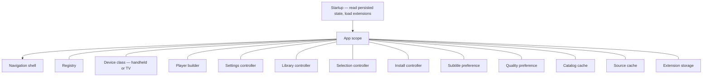
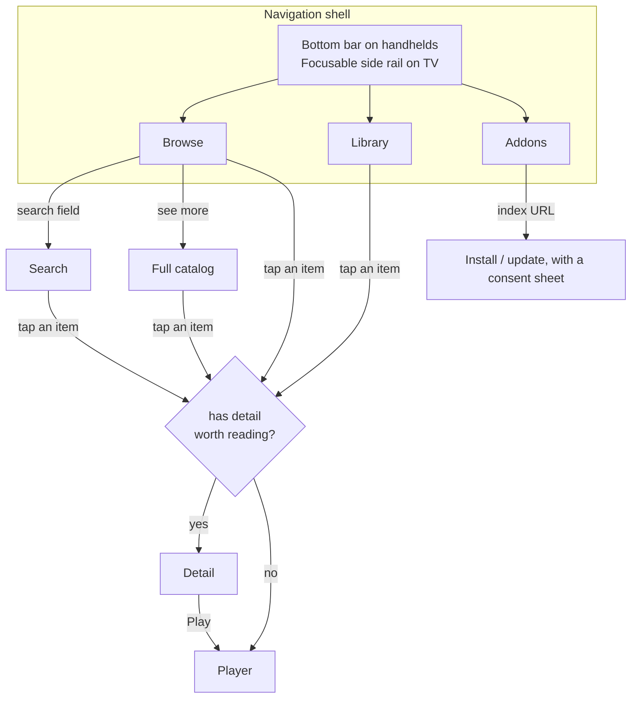
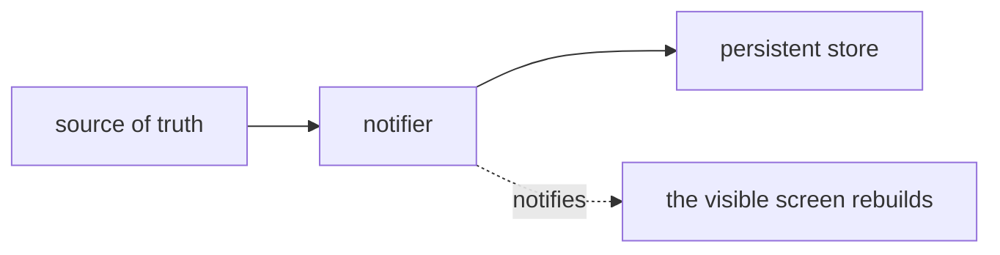
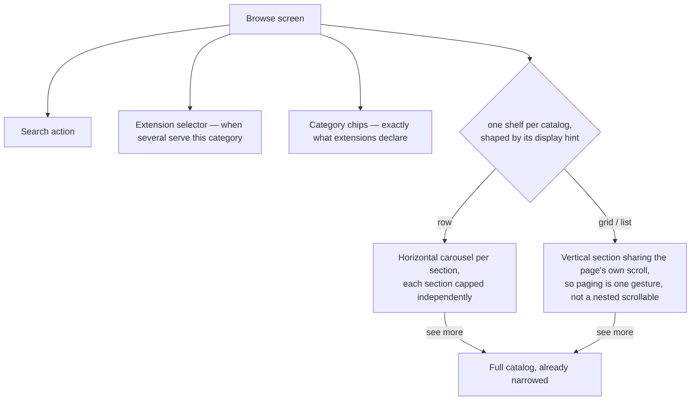
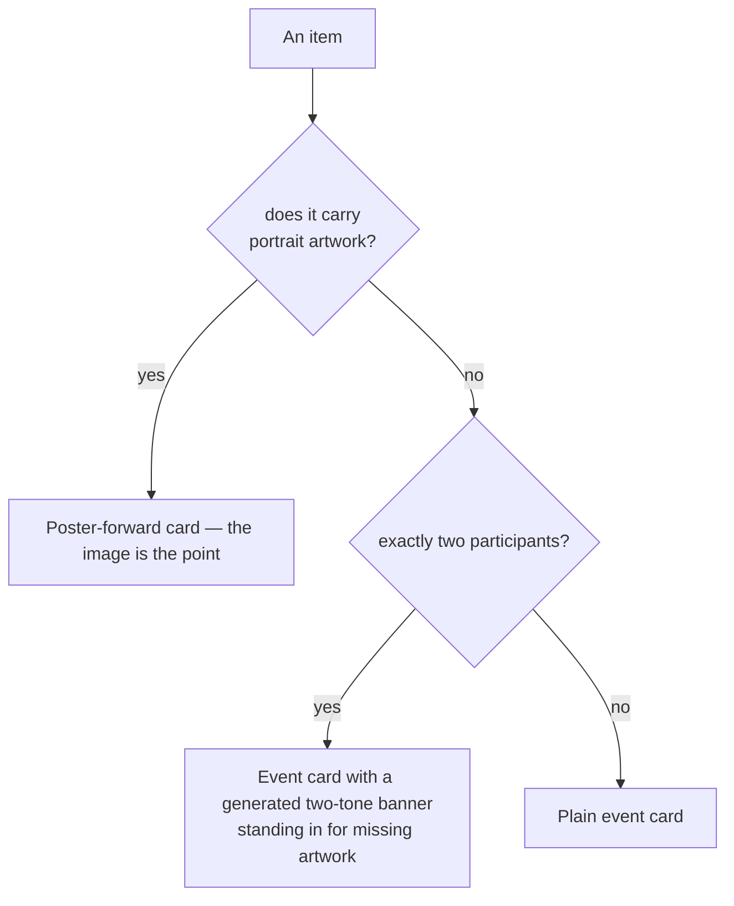
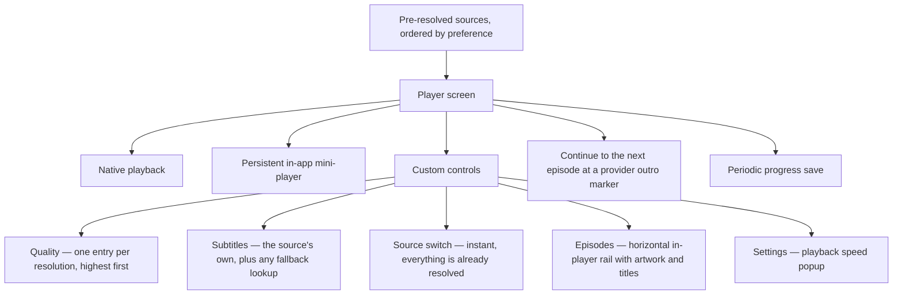

# 6. App Layer

The shell contains navigation, screens, controllers, caches, and playback. Provider-specific
logic remains in extensions.

## 6.1 Composition

An app-wide scope above the widget tree provides shared dependencies. These dependencies are
constructed before the first frame.

Two entries provide test seams:

- the **player builder**, so tests substitute a fake and never touch a native player;
- the **extension loader** used by the installer, so the whole install flow is exercisable
  without a real engine.

Persisted state is loaded before the UI so the first frame uses the saved category,
extension, and preferences.

**Extension storage** is read in that same startup pass, and for a stricter reason than the
rest: it backs `host.storage`, whose functions are synchronous, so every value an extension
can ask for has to already be in memory before any bundle is evaluated. Each installed
extension gets its own store, keyed by manifest id and handed to its engine at load. The
shell keeps one opaque blob per extension and never interprets it; uninstalling drops that
extension's blob. What an extension keeps there is its own cache — typically an upstream
response too slow to re-fetch on every cold start.

## 6.2 Navigation

The navigation bar is **app-owned and fixed**. A bar whose entries change with what is
installed is disorienting; a stable bar gives the application a shape of its own.

Search is **not** a navigation destination. It spans every extension and no category, so it
opens from a field on the browse screen onto its own surface rather than contradicting the
category chips above it.

Whichever destination is showing is rebuilt when settings or the library change, so
toggling an extension or favouriting an item takes effect immediately without either screen
knowing about the other.

Primary destinations use the shared app bar component. It owns the title spacing, dark surface,
and action placement so Home, Library, Addons, and Settings keep the same top-level treatment.

## 6.3 Controllers

Four concerns, one pattern: a notifier over a plain store, persisted on every change,
fire-and-forget — a failed write must not stop the choice taking effect for the rest of the
session.

| Controller | Source of truth | Notes |
|---|---|---|
| Settings (addons) | **the registry itself** | The registry stays framework-free with no notification mechanism of its own; this is the persisting front end over it. |
| Library | its own record map | Recording a watch must never wipe a saved resume position. |
| Selection | its own chosen extension id | Falls back to the first available without overwriting the stored preference, so an uninstalled or disabled choice takes effect again the moment it returns. |
| Subtitle preference | its language code and appearance | Native subtitle tracks declared by the video backend remain under native-player control. When there is no remembered external selection, a source-provided track matching the preferred language is auto-applied. If the preferred language is absent but another source subtitle exists, the picker asks the viewer to choose the source track before translating it into a temporary SRT while preserving cue timing; translation is best-effort and session-only. The complete result of an explicit external-subtitle fetch is cached per media item, and the selected external track is remembered for later auto-apply. The persisted external-track cache is bounded and restored after the shell is shown. Successful OpenSubtitles/SubSource search results are retained per media and language only while the app session remains active; the active result is checked in the picker, but its temporary file and provider metadata are not persisted. VTT/SRT cue HTML is rendered as safe inline subtitle formatting, without loading content from markup. New external-subtitle lookup remains explicit. A subtitle failure releases playback rather than blocking it. With no preference, the picker lists every fetched track; with a preference, it lists only languages supported by Settings. Text size, text color, background color, and outline are global appearance preferences shared by both player backends. |
| Playback segments | item-level intro/recap/outro intervals | Optional segment lookup runs alongside source discovery. The player keeps the result in session state, highlights known intervals on the seekbar, offers an explicit Skip intro action only for episodes, and starts Up Next from a provider-supplied outro marker or falls back to one minute remaining when no outro is available; when an episode completes, the active session advances to the next available episode unless the viewer dismissed or paused Up Next, and missing or failed metadata never blocks playback. |
| Quality preference | its maximum automatic video height | Global and persistent. Auto leaves the native backend's adaptive choice alone; a selected cap picks the highest available rendition at or below it when the stream exposes multiple video tracks. If a source has no rendition under the cap, the lowest available track is used. Manual quality switching in the player remains available. |
| Picture in Picture preference | whether active full-video playback may enter native PiP when the app backgrounds | Global and persistent. It defaults to enabled for existing users. Back changes the player to the in-app mini-player without requesting PiP; the active full-video session remains eligible if the app is subsequently backgrounded. |
| Install | the index listing plus the registry | Consent defaults to refusal. |
| NSFW visibility | the registry plus a persisted app preference | **Show NSFW content** controls catalogs explicitly marked `mature`; unknown declarations remain compatible with older extensions. |

## 6.4 Screens

### Browse

When catalog data is available, Home starts with one edge-to-edge featured carousel
inside the app bar's expanded area.
It merges the enabled category feeds and preserves their section and item order as the
extension's editorial signal. Selection fills distinct slots for live events, leading
videos and series, events starting within 24 hours, recent releases, and top-rated
content. Remaining slots use a combined editorial, freshness, rating, and artwork score.
Soft per-kind limits keep the carousel varied when several kinds are available without
leaving it short when the catalog contains only one kind. Duplicate references and ended
events are removed. Items without portrait or landscape artwork are left out because the
hero is artwork-led, except events and channels: those receive deterministic full-bleed
artwork from their opaque identity, participant colors, and participant logos. The same
generator is used when a supplied live artwork URL fails. Equal candidates use a stable
daily tie-break so their order does not change during a session. When a refresh changes the
item occupying a hero page, the page remains at that position but the slide is keyed by the
item's opaque reference; any previous trailer preview is disposed instead of continuing
against the new item.

Play resolves the selected item immediately, Favorite writes to the app library, and
Info follows the normal detail-or-play navigation rule.
Video and series items use `artwork.logo` as the featured title mark when supplied;
otherwise the text title is limited to one line. A failed logo request falls back to the
text title.

The featured artwork and gradient extend behind the status bar on handhelds. Category
chips are a separate pinned sliver below the app bar. This keeps the current category
available while the hero collapses normally.
While the featured feed is loading, the hero keeps the same expanded height and shows a
shimmer placeholder. An empty or failed feed removes the hero instead of leaving a blank
surface. Featured trailer previews are inline-only and are never eligible for native Picture
in Picture.

At app startup, a persisted catalog renders first and Home silently refreshes it in the
background; a failed refresh leaves that usable snapshot visible. Pull-to-refresh still
explicitly refetches what is on screen while keeping it visible.

When an extension declares an `all` category, Home places the app-owned Continue Watching
shelf above its catalogs. It shows at most ten latest unfinished items, uses the saved landscape
artwork and a compact persisted playback indicator, keeps only the latest played episode per
series, and lets the viewer mark an item as watched to remove it from the shelf while retaining
its history. Unavailable extensions are omitted.

Catalog sections with no items are omitted from Home. A loading or failed catalog remains visible
so the user can distinguish a temporary problem from an empty section. When multiple catalogs or
response sections use the same `content on service` name shape — for example, `Movies on Netflix`
and `Movies on Hulu` — Home groups them under the shared content title and shows a service
selector. A grouped response section stays at the position of its first matching section, while
only the selected list is rendered. Separate catalogs remain independently cached and their
full-catalog actions still open the original catalog. A lone catalog or section, or one without
that name shape, keeps its declared title and existing shelf behavior.

Home uses a pinned app bar with the featured hero in its expanded area, followed by a separate
pinned category header. The hero collapses normally; no snap animation is used.
When collapsed, the hero fades out completely so its artwork does not remain behind the toolbar.

### Full catalog

Filter bar, subcategory chips, grid, and endless scrolling driven by the opaque cursor an
extension returns. Arriving already narrowed (from a section's "see more") suppresses the
chips — the choice was made on the way in and the title bar names it; offering to undo it is
what the back button is for.

The filter bar renders the filter keys it has UI for and silently skips any it does not, so
an extension can declare a filter ahead of the shell supporting it without breaking.

### Detail

Hero artwork, metadata, a full-width Play button, a reactive action row, a collapsible
synopsis, optional trailer actions, cast, episodes, and an optional related-items shelf.
A trailer with a `video/*`
MIME may autoplay as the header preview; other trailer URLs open in the platform
browser view (Chrome Custom Tab on Android), with an external-app fallback. Trailer
previews do not enter the normal source-resolution pipeline or native Picture in Picture.
The detail screen may warm
cheap source descriptors for the primary/resume episode in the background, but signed
stream URLs remain **gated behind Play**.

The Play button's label is computed rather than fixed, so it states what will actually
happen: start, continue, or continue at a named episode. Episode cards show a saved playback
fraction when its position and duration are available.

### Library

Favorites, rendered with the same cards used everywhere else. Continue Watching belongs on Home;
watch history remains stored for playback decisions but is not a Library surface. Records whose
extension is no longer installed render dimmed and marked unavailable. Custom user lists are a
separate future library model rather than a variant of watch history.

### Addons

Per-extension switches, per-provider sub-switches, the Add dialog with its extension index
field, a separate selection dialog for repository entries, installed-extension release details,
manual update checks, update status, and the permission consent sheet. The selection dialog stays
open for multiple installs; after the first successful install, the underlying URL dialog is
dismissed so closing the selection dialog returns directly to Addons. Update consent shows the
latest release note and only adds an expandable network-access section when new hosts are
requested, so the prompt stays short while relevant permission details remain available.

### Search

Cross-extension, category-agnostic, one grid. See
[User Journey §4.5](04-user-journey.md#45-searching).

## 6.5 Card layout

The shell renders **what an item carries**, not what its kind implies. A two-sided fixture
with no artwork still reads as a real card rather than an empty rectangle, because a banner
is synthesized from the event's optional branding and participants — using competition colours
when supplied, then participant colours when available,
and a deterministic fallback when it does not. Participant colours that cannot be parsed
degrade to that fallback; malformed branding is rejected at the protocol boundary.

Poster cards are image-first: they use a 2:3 frame, omit the title, show the release year
as an upper-left image overlay, and show the rating as an upper-right image overlay. Event and
summary cards retain their compact footer metadata. These presentation choices are reversible
without any protocol change.

## 6.6 Player

| Concern | Decision |
|---|---|
| Live versus on-demand | Derived from the item's kind and threaded into the player. Live playback keeps a seekable buffer and advances its timeline while intentionally paused, so the thumb falls behind and the LIVE indicator dims as the broadcast continues. Native live latency and buffering are configured through optional `VideoPlayerLiveOptions`, whose defaults are conservative for AVPlayer and Media3; the configuration is ignored for on-demand sources. A scrub near the right edge snaps to a safe point just behind the latest available position; an already-live scrub is a no-op so it does not flush the decoder unnecessarily. On-demand gets duration-based seeking. |
| Live manifest normalization | Clear live playback uses a session-scoped loopback `HttpServer` when the resolved stream can be routed through the app proxy. It rewrites playlist resource URLs to stable local ids while refreshing rotating signed upstream URLs, forwards playback headers and byte ranges, and is disposed with the player session. The proxy is a foreground-scoped fallback; background playback still depends on the native player and may lose the local server if the app is suspended. |
| Quality list | Collapsed to one entry per resolution; the placeholder "default" track is dropped, because that is what "Auto" already means. When an explicit preferred height has a provider URL variant, startup opens that variant directly instead of opening the base stream and replacing the player afterwards. Manual URL-variant switching initializes the replacement while the current player keeps playing, then pauses only to align position and swap. |
| Episode list | Episodic playback exposes the loaded guide as an app-owned horizontal rail above the timeline. The current episode is centered and highlighted; selecting another available episode replaces the current player route through the normal playback workflow. Unreleased episodes remain visible but disabled. |
| Playback speed | The top-right Settings action opens an app-owned popup with 0.5x, 0.75x, 1x, 1.25x, 1.5x, and 2x presets. The selected speed is applied through the shared player contract across native backends and remains active when the current player controller is replaced. |
| Landscape presentation | Full playback follows the device orientation by default. The top-right player control can request both landscape orientations for the active full-player presentation, which is useful when device rotation is locked; minimizing, leaving, or entering native PiP releases the request, while restoring the full player reapplies the viewer's session choice. Portrait-oriented Shorts and previews keep their own presentation policy. |
| Continuing | Replaces the current screen rather than stacking one per episode, and the episode list is passed in once rather than refetched each time. |
| Resuming | A position very near the start reads as "start over"; one very near the end counts as finished. Episode identity is checked before seeking. The native player seeks to the saved position after initialization and before its first play request, then position tracking attaches when playback is ready. |
| Picture in Picture | On iOS, active full playback is eligible for native PiP when the app backgrounds, whether its app-owned presentation is full-screen or the in-app mini-player; Detail and Featured Hero previews are never eligible. The player is attached to a persistent entry in the app Navigator's overlay from playback start, so Detail/Home routes remain the real caller underneath. Clear playback uses the texture backend: its invisible AVPlayerLayer is registered with AVKit for PiP while Flutter controls remain above the rendered video; protected playback may use a platform view. Full playback opts out of the video package's normal background pause observer so AVPlayer can continue through the native PiP transition. Back never requests native PiP: it changes the session to the in-app mini-player, which remains eligible for automatic PiP if the app is subsequently backgrounded. Expanding PIP restores the app-owned presentation that was active when PIP started. Native PiP restore and close continue to use the same persistent surface; closing the PiP window pauses and disposes the hosted player. PiP renders the native video layer only; Flutter controls and subtitles are not part of the PiP surface. |
| In-app mini-player | The shared `video_player_mini_player` host keeps the same Flutter/native player widget in one persistent overlay. A downward drag publishes progress continuously, interpolating the surface into a bottom-right-docked card; release past the threshold commits the minimized state, while a short drag springs back. Tapping the card restores full screen; the minimized card can be dragged directly and follows the pointer until release, then snaps to the nearest of the four corners. The host stays below newly pushed routes, so the caller remains usable without reparenting the native surface. |
| Source cache | Persists source descriptors but never resolved streams. Cached descriptors are filtered against the current Addons provider switches before playback. Live events and channels bypass both cache layers because their signed URLs are short-lived. Cached VOD descriptors resolve in parallel: the preferred descriptor gets a short grace window, then a ready fallback may open playback while slower alternatives continue toward the picker. Initial on-demand discovery asks fan-out extensions for the first non-empty provider result, then starts complete discovery and resolution in the background; a slow provider must not hide a ready fallback. Source discovery and each source resolve have bounded waits, and provider errors are dropped independently. The selected source stays first when the complete result refreshes, while remaining sources are added to the picker individually as each resolves. |
| Errors | If the first source fails before playback initializes, mark it failed and try the next resolved source, including one that arrives through the active background fan-out. After playback starts, never auto-advance; keep retry and source switching available. |

## 6.7 Platform handling

- **Device class** decides handheld versus TV, which swaps the bottom bar for a focusable
  side rail and adjusts breakpoints.
- **Capability gating** is a positive list per platform: a stream is playable only if this
  platform is known to handle its container and its protection scheme. A newly-encountered
  combination is dropped rather than optimistically attempted, and the user is told when
  nothing survives. The current buffering investigation routes every supported clear source on
  Android, macOS, and iOS through the official `video_player` backend, forwarding
  extension-provided HTTP headers and external subtitles. Unsupported combinations—including
  separate `audioUrl` tracks and containers not handled by the native implementation—are
  rejected explicitly rather than silently dropping media. Widevine routes through Media3 on
  Android and FairPlay through AVFoundation on iOS/macOS; both require a platform view and a
  network source. ClearKey uses an inline JSON key set on Android; unsupported or incomplete
  DRM declarations remain rejected.
- **Native playback has one backend.** If video_player stalls or rejects a source, the app reports
  that failure and keeps retry/source-switch controls available; it does not silently switch to a
  second player implementation.
- **Picture in Picture** is currently an iOS-only capability exposed by the shared player contract.
  Clear iOS playback uses the texture path, whose invisible AVPlayerLayer is registered as the
  AVKit source; protected playback uses the native platform-view path. The app attaches the keyed
  Player widget to a persistent entry in the app Navigator's overlay and enables background playback
  for the full iOS player so the package lifecycle observer does not
  pause it during PiP.
  While PiP is active the player surface is clipped and its native surface stops accepting
  touches, revealing Detail, Home, or the caller underneath without reparenting the player.
  Routes pushed later, including source sheets, remain above the player entry. AVKit restores that
  same player surface in place when PiP expands. Closing the PiP window pauses the native player
  and emits a close event; the app detaches the hosted widget, which disposes the AVPlayer and
  releases its audio session.
  Native PiP is unsupported on other platforms, but Back still uses the app-owned mini-player.
  Flutter-rendered controls and subtitles are not available inside the native PiP window.
- **In-app mini-player** is separate from system PiP. It is implemented by the reusable
  `video_player_mini_player` package, while the forked `video_player` package remains responsible
  for the native surface and system PiP APIs. The same player widget stays mounted in one overlay
  entry while its bounds, corner radius, and interaction mode change. The drag interpolates
  directly from the full-screen rect to the bottom-right-docked rect. A tap anywhere on the card restores
  full screen; the mini bar overlays the top of the video with playback toggle on the left and
  close on the right; the compact frame stays 16:9 and is capped at 200px wide, with 24px rounded
  translucent-black backgrounds per icon rather than a full-width toolbar. The card can drag to
  the top-left, top-right, bottom-left, or bottom-right corner; dragging follows the user's
  finger and snaps to the nearest corner on release. Native PiP temporarily
  disables that host's hit testing so the underlying caller can receive input.
- **Desktop playback controls** stay app-owned: Space toggles play/pause, J/L seek ten seconds,
  arrow keys seek five seconds, F toggles fullscreen, and Escape exits it. This
  keeps source, subtitle, quality, retry, and Up Next controls available across platforms.
- **Audio tracks** are exposed through the shared player contract whenever video_player reports
  more than one track. The same picker and selection UI is used on every backend.
- **Fonts are bundled, not fetched at runtime.** A runtime font fetch lays the first frame
  out against a narrower fallback, and text that sizes tightly to its content stays clipped
  once the real font arrives.
- **Branding is generated from one source image.** The launcher and native splash assets use
  `apps/app/assets/logo/logo.png`; their configurations live in
  `apps/app/flutter_launcher_icons.yaml` and `apps/app/flutter_native_splash.yaml`. From
  `apps/app`, regenerate them with `dart run flutter_launcher_icons -f flutter_launcher_icons.yaml`
  and `dart run flutter_native_splash:create --path=flutter_native_splash.yaml`.

## 6.8 Test seams

| Seam | Replaces |
|---|---|
| Registry in the app scope | A fake registry — no network, no engine |
| Player builder | A fake player — no native view |
| Installer's extension loader | A stub — the install flow without an engine |
| Injectable clock in the source cache | Deterministic staleness |
| Platform override | Exercises another platform's capability rules on any host |
