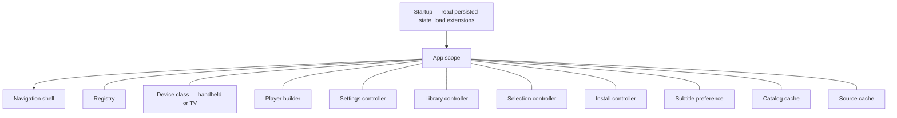
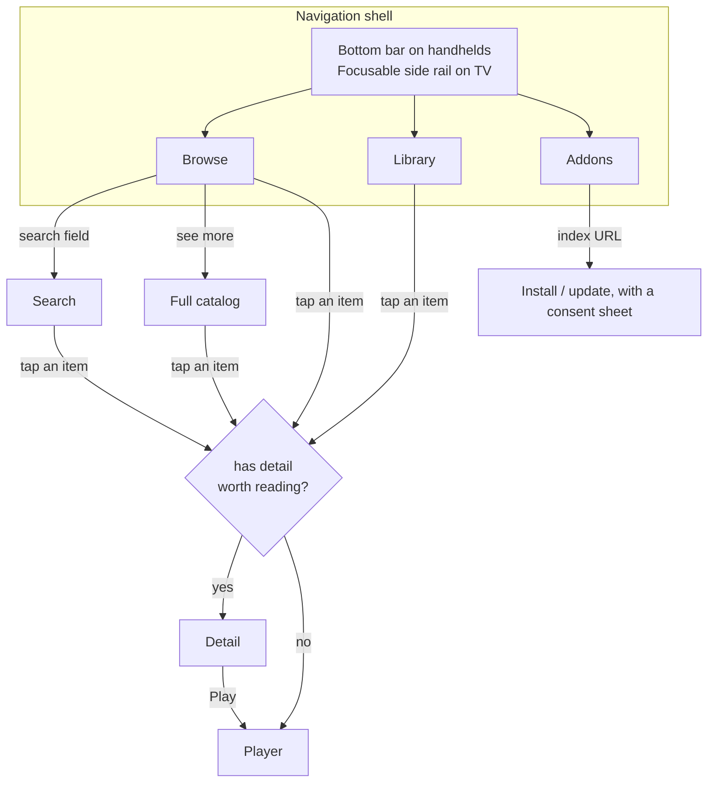
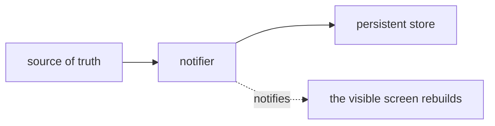
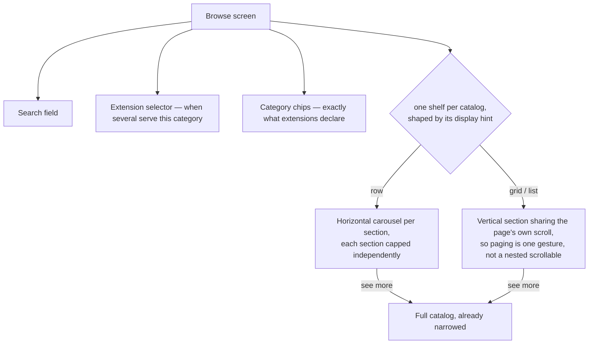
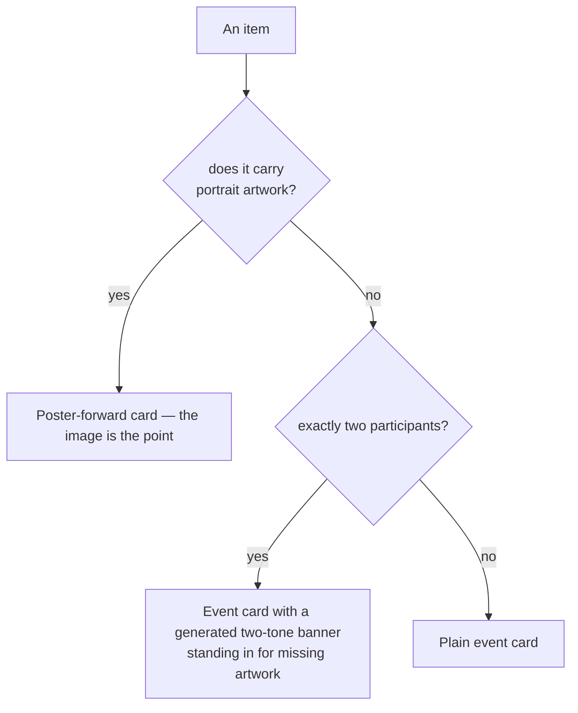
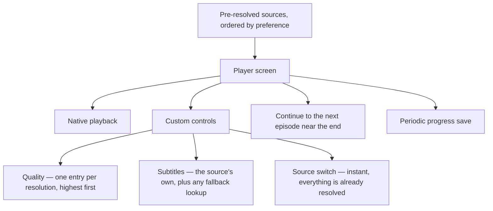

# 6. App Layer

The shell contains navigation, screens, controllers, caches, and playback. Provider-specific
logic remains in extensions.

## 6.1 Composition

An app-wide scope above the widget tree provides shared dependencies. These dependencies are
constructed before the first frame.

Two entries provide test seams:

- the **player builder**, so tests substitute a fake and never touch a native player;
- the **extension loader** used by the installer, so the whole install flow is exercisable
  without a real engine.

Persisted state is loaded before the UI so the first frame uses the saved category,
extension, and preferences.

## 6.2 Navigation

The navigation bar is **app-owned and fixed**. A bar whose entries change with what is
installed is disorienting; a stable bar gives the application a shape of its own.

Search is **not** a navigation destination. It spans every extension and no category, so it
opens from a field on the browse screen onto its own surface rather than contradicting the
category chips above it.

Whichever destination is showing is rebuilt when settings or the library change, so
toggling an extension or favouriting an item takes effect immediately without either screen
knowing about the other.

## 6.3 Controllers

Four concerns, one pattern: a notifier over a plain store, persisted on every change,
fire-and-forget — a failed write must not stop the choice taking effect for the rest of the
session.

| Controller | Source of truth | Notes |
|---|---|---|
| Settings (addons) | **the registry itself** | The registry stays framework-free with no notification mechanism of its own; this is the persisting front end over it. |
| Library | its own record map | Recording a watch must never wipe a saved resume position. |
| Selection | its own chosen extension id | Falls back to the first available without overwriting the stored preference, so an uninstalled or disabled choice takes effect again the moment it returns. |
| Subtitle preference | its own language code | Ranks resolved sources with a matching track ahead of provider order. For on-demand playback, autoplay waits for that stream-provided track to apply; a subtitle failure releases playback rather than blocking it. External subtitles are fetched only after an explicit viewer action. With no preference, the picker lists every fetched track; with a preference, it lists only languages supported by Settings. |
| Install | the index listing plus the registry | Consent defaults to refusal. |

## 6.4 Screens

### Browse

Pull-to-refresh refetches what is on screen while keeping it visible. It is the only thing
that refetches a category the app already holds.

When an extension declares an `all` category, Home places the app-owned Continue Watching
shelf above its catalogs. It uses the saved landscape artwork and a compact persisted playback
indicator; unavailable extensions are omitted.

### Full catalog

Filter bar, subcategory chips, grid, and endless scrolling driven by the opaque cursor an
extension returns. Arriving already narrowed (from a section's "see more") suppresses the
chips — the choice was made on the way in and the title bar names it; offering to undo it is
what the back button is for.

The filter bar renders the filter keys it has UI for and silently skips any it does not, so
an extension can declare a filter ahead of the shell supporting it without breaking.

### Detail

Hero artwork, metadata, a full-width Play button, a reactive action row, a collapsible
synopsis, cast, and episodes. Source discovery is **gated behind Play** — the screen shows
what metadata returned and pays for nothing more until the viewer commits.

The Play button's label is computed rather than fixed, so it states what will actually
happen: start, continue, or continue at a named episode. When saved progress and duration are
available, a progress outline around the primary action shows the current completion fraction.

### Library

Favourites, history, and continue-watching, rendered with the same cards used everywhere
else. Records whose extension is no longer installed render dimmed and marked unavailable.

### Addons

Per-extension switches, per-provider sub-switches, the extension index field, install and
update rows, and the permission consent sheet.

### Search

Cross-extension, category-agnostic, one grid. See
[User Journey §4.5](04-user-journey.md#45-searching).

## 6.5 Card layout

The shell renders **what an item carries**, not what its kind implies. A two-sided fixture
with no artwork still reads as a real card rather than an empty rectangle, because a banner
is synthesized from the participants — using colours an extension supplies when it has them,
and a deterministic fallback when it does not. A malformed colour degrades to that fallback
rather than throwing.

Scores are carried in the model but **not rendered** — a product decision, reversible
without any protocol change.

## 6.6 Player

| Concern | Decision |
|---|---|
| Live versus on-demand | Derived from the item's kind and threaded into the player. Live playback keeps a seekable buffer, dims its LIVE indicator when playback trails the edge, and snaps a scrub near its right edge to the latest available position after resuming; on-demand gets duration-based seeking. |
| Quality list | Collapsed to one entry per resolution; the placeholder "default" track is dropped, because that is what "Auto" already means. |
| Continuing | Replaces the current screen rather than stacking one per episode, and the episode list is passed in once rather than refetched each time. |
| Resuming | A position very near the start reads as "start over"; one very near the end counts as finished. Episode identity is checked before seeking. Position tracking attaches after native playback is ready, so progress remains available across platforms. |
| Source cache | Persists source descriptors but never resolved streams. The selected source stays first when discovery refreshes, so a restart resolves the same source before the remaining sources are refreshed in the background. |
| Errors | **Never auto-advance.** Live streams report spurious errors, and auto-advancing skips good sources. |

## 6.7 Platform handling

- **Device class** decides handheld versus TV, which swaps the bottom bar for a focusable
  side rail and adjusts breakpoints.
- **Capability gating** is a positive list per platform: a stream is playable only if this
  platform is known to handle its container and its protection scheme. A newly-encountered
  combination is dropped rather than optimistically attempted, and the user is told when
  nothing survives.
- **Fonts are bundled, not fetched at runtime.** A runtime font fetch lays the first frame
  out against a narrower fallback, and text that sizes tightly to its content stays clipped
  once the real font arrives.

## 6.8 Test seams

| Seam | Replaces |
|---|---|
| Registry in the app scope | A fake registry — no network, no engine |
| Player builder | A fake player — no native view |
| Installer's extension loader | A stub — the install flow without an engine |
| Injectable clock in the source cache | Deterministic staleness |
| Platform override | Exercises another platform's capability rules on any host |
