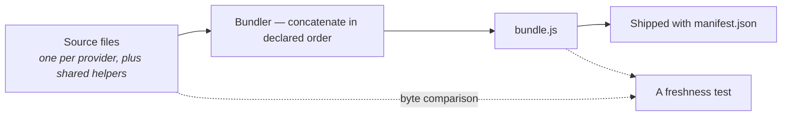
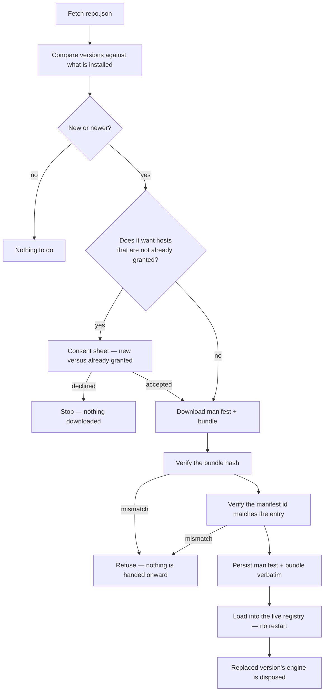
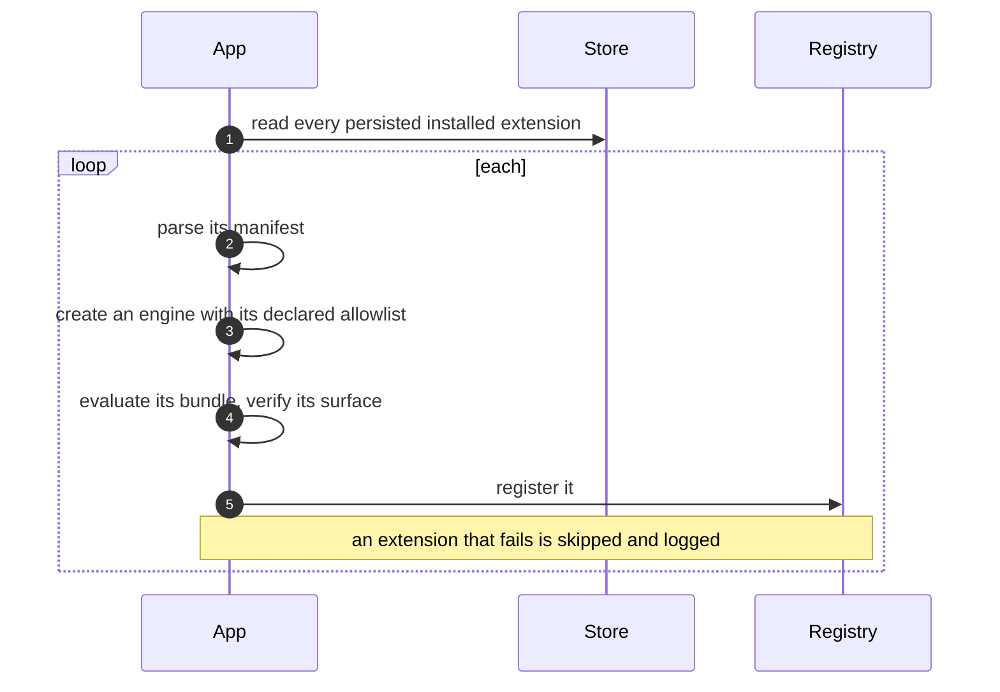
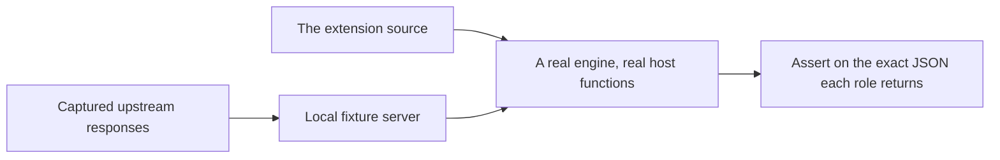

# 7. Packaging & Distribution

How an extension goes from source files to something running on a user's device.

## 7.1 What ships

An extension distribution contains two files:

```
<extensionId>/
├── manifest.json     ← identity, providers, catalogs, permissions
└── bundle.js         ← one file, named by manifest.entry
```

Bundled and downloaded extensions use this format and follow the same loading path. The
loader reads the bundle name from `manifest.entry`.

## 7.2 Bundling

Source files stay separate for development and testing; the bundler concatenates them, in a
declared order, into one `bundle.js`.



**Order matters** because the files coordinate through shared globals:

| Constraint | Reason |
|---|---|
| The file that creates the extension surface goes first | Every other file adds to it. |
| A file goes after anything whose helpers it calls | Plain script concatenation, no module system. |
| Files that only register into a registry array are otherwise order-independent | That is the point of the registry pattern — see [Extension Protocol §2.7](02-extension-protocol.md#27-one-bundle-many-providers). |

`bundle.js` is **generated but committed**, like a lockfile. Regenerating is a manual step,
and a dedicated test catches the failure mode that invites: it byte-compares the committed
bundle against a fresh concatenation of its declared sources and fails loudly if a source
was edited without regenerating.

## 7.3 Hosting an index

Extensions are static files. There is no backend, and none is planned — on-device execution
is what makes IP-bound signed URLs and region-locked streams work at all, and a server
route would break both.

```
<index root>/
├── repo.json
└── <extensionId>/
    ├── manifest.json
    └── bundle.js
```

`repo.json` lists what is on offer. Each entry carries:

| Field | Purpose |
|---|---|
| `id` | Must match the manifest's own id, or the install is refused |
| `name`, `version` | Shown in the list; version drives update detection |
| `manifestUrl`, `bundleUrl` | Where the two files live |
| `bundleSha256` | What the downloaded bundle must hash to |
| `hosts` | **Duplicated from the manifest** so the consent prompt can be shown *before* anything is downloaded |
| `description`, `author`, `iconUrl` | Optional listing metadata shown before download |
| `releaseNotes` | Optional list of user-facing changes shown before an update |

Serve it from a real CDN rather than raw repository URLs, and version by tag.

**Versions compare numerically per dotted segment**, so `0.10.0` is newer than `0.9.0`.
Keep versions to plain dotted integers; pre-release and build-metadata suffixes are not
interpreted.

## 7.4 The install pipeline



Install requirements:

- **All-or-nothing.** A partially verified download is never handed onward. Either every
  check passes or nothing comes back.
- **The consent prompt precedes the download**, which is why permissions are readable from
  the index.
- **Only widening asks again.** An update that adds no hosts installs silently; one that
  does shows only the difference.
- **Installing replaces in place.** An update keeps the extension's position, so the user's
  shelves do not reorder, and keeps its on/off state, so something switched off stays off.

### On verification

Hash verification proves the downloaded bundle matches what the index **currently claims**
it should be. It catches transit corruption and a bundle swapped without updating the hash
beside it. It proves nothing about the index itself: whoever can edit or intercept
`repo.json` can update the hash to match whatever they replaced the bundle with.

Treat an index URL as a trust decision by the user, and present it that way. The consent
sheet is the real control for a third-party index.

## 7.5 Loading at startup



The application starts with an empty registry and populates it from persisted installations.

## 7.6 Testing an extension

Test extensions with the production engine and a local HTTP fixture server.



| Layer | What to assert |
|---|---|
| Role output | The exact JSON, field for field — not "the shape looks right" |
| Source ids | That an id produced by `sources()` resolves, and routes to the right provider |
| Ciphers and decoding | Against captured real payloads, and against published test vectors where one exists |
| Failure paths | A provider that throws contributes nothing and does not fail the fan-out |
| Bundle freshness | The committed bundle matches its sources |

Test guidelines:

1. **Prove a test can fail.** After adding a check, break the thing it protects, watch that
   specific assertion fail, then revert. A test that cannot fail is not a test.
2. **Capture fixtures from the real upstream**, and keep them. They are what tells you an
   upstream changed shape rather than merely went down.

## 7.7 Release checklist

1. Every new host — **including redirect targets** — is declared in `permissions.hosts`.
2. Every new provider and catalog is declared in `manifest.json`.
3. `version` is bumped, in plain dotted-integer form.
4. The bundle is regenerated and the freshness test passes.
5. Tests pass against fixtures, including the failure paths.
6. `repo.json` is updated: version, `bundleSha256`, and `hosts` mirrored from the manifest.
7. Add concise `releaseNotes` for changes users will notice.
8. If the update widens `hosts`, expect users to be asked again — make sure the additions
   are ones you can justify on a consent sheet.
