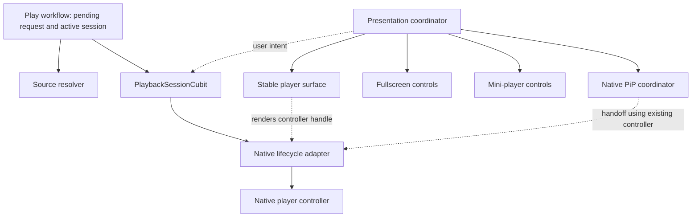

# 15. Playback Session Architecture

This document defines the target ownership model for playback. It is an app-layer
design document: it does not change the extension protocol or introduce a second
streaming backend.

Status: proposed architecture, not implemented. Component names below describe
responsibilities; they do not require a new package or interface for every box.

## 15.1 Motivation

The current playback route combines source workflow, native-player lifecycle,
playback state, presentation, and controls. That makes a presentation change
look like a playback change and makes route disposal a threat to the native
player.

The target boundary is:



The primary invariant is:

> Fullscreen, mini-player, and native PiP transitions preserve the same logical
> playback session and native player instance. A presentation change never
> authorizes controller replacement; unsupported PiP follows the documented
> dismissal behavior.

The Flutter widget identity is an implementation technique for preserving native
surface identity. It is not the business-level playback contract.

## 15.2 Ownership boundaries

### Source resolver

The source resolver is an app-layer service with injected registry, cache, and
preference dependencies. It owns the technical source workflow:

- discover opaque source descriptors;
- read and write descriptor caches;
- resolve a descriptor into a short-lived playable stream;
- resolve a source again when its URL or token is stale;
- fan out across enabled providers;
- expose partial results as individual resolutions settle;
- apply bounded timeouts and technical retry rules;
- report source-scoped failures without failing the whole batch.

`SourceCache` owns cache records. The resolver uses its API and returns immutable
results; the session owns the accepted source list and selection. Selection is
promoted through the cache API, not through shared mutable lists.

It must not know about Flutter widgets, routes, overlays, snackbars, mini-player
mode, PiP presentation, or `BuildContext`.

Discovery and resolution remain separate operations. Source descriptors are
persisted as before. The app keeps exactly one last-used on-demand resolved
stream in platform secure storage; it must never enter the plain-text
source-list store. This cache is an optimization, not a durable source record:
try it once on resume, then resolve that same descriptor after a pre-start
playback failure. Live stream results remain memory-only.

The resolver provides candidates and fresh streams. It does not decide the
user-facing playback policy for a native playback error. That policy belongs to
the playback session: for example, pre-start failure may try another resolved
source, while a source that already played must not be silently auto-advanced.

### Playback session

The playback session is the route-independent owner of one active media playback.
It owns the logical playback state and the native controller handle:

- media identity and item snapshot;
- current source descriptor and resolved stream;
- active source identity and source ordering;
- native controller lifecycle;
- a read-only projection of native initialized, playing, buffering, position,
  duration, and live-window observations;
- selected subtitle, audio, quality, fit, and playback speed state;
- playback errors and recovery state;
- source switch and fresh-resolution commands;
- playback events consumed by presentations and controls.

The session may replace its native controller for an explicit source switch,
expired signed URL, incompatible stream variant, or backend recovery. The logical
session must survive that replacement and carry forward the state that remains
valid, such as position, user preferences, and selected media.

The session should not become a general-purpose owner of every player concern.
Progress persistence, external subtitle lookup, episode navigation, and UI
effects remain focused collaborators when they have independent lifecycles.

Use `PlaybackSessionCubit` with immutable state and constructor-injected
dependencies, following document 12. Scope it to the active playback lifetime
above the replaceable route presentation, not to a fullscreen widget. The play
workflow holds the active reference and serializes activation/replacement; it
does not duplicate playback state. Keep high-frequency native observations in a
read-only stream/listenable with narrow selectors; do not emit a whole structural
player state on every position tick.

The session owns disposal authority. A focused native lifecycle adapter executes
create/open/replace/dispose and exposes the existing playback commands plus a
renderable controller handle. Neither the view nor the presentation coordinator
can independently dispose that controller. `close` is idempotent: invalidate
pending attempts, release session-owned subscriptions/timers/work, finish required
native handoff/close coordination, and dispose the native resources exactly once.

Keep selected preferences separate from native observed tracks: the session owns
user intent, the native adapter reports what was actually applied. Global settings
remain owned by the existing preference controllers. A source change reapplies
compatible choices; stale native track IDs are never assumed valid for a new item.

### Player surface

The player surface binds the session's native controller to the Flutter/native
rendering surface. It owns rendering concerns such as:

- stable native surface construction;
- viewport bounds and aspect-ratio updates;
- platform-player widget configuration;
- surface clipping and hit testing during native PiP;
- rendering the current stream without recreating the surface for playback ticks.

The surface does not discover sources or decide which source to try next.

### Presentation coordinator

The presentation coordinator owns where and how the surface is presented:

- fullscreen route or persistent overlay placement;
- in-app mini-player bounds, drag, dock, and restore behavior;
- native PiP handoff and restore callbacks;
- interaction blocking while native PiP owns input;
- route ordering so the player remains below newly pushed app routes;
- close/restore intent and overlay removal after session cleanup coordination.

Native PiP is a coordinator, not another playback session. The native system gets
the playback rendering target while the logical session remains alive.

## 15.3 State ownership rule

Each value has one owner:

| State | Owner | Consumers |
|---|---|---|
| Persisted source descriptors | SourceCache | Resolver and source picker |
| Single last-used resolved VOD record | Secure store through SourceCache | Play workflow loads it for resume and overwrites it with the active source |
| In-flight discovery/resolution operation | Source resolver | Pending request or session holds a consumer subscription |
| Accepted source candidates for this playback | Playback session | Picker, recovery policy |
| Active source and recovery policy | Playback session | Controls, diagnostics, surface |
| Native controller lifecycle/disposal authority | Playback session | Native lifecycle adapter executes; surface borrows the handle |
| Observed position, buffering, and active native tracks | Native controller through its adapter | Session, controls, progress tracker |
| Requested subtitle, quality, audio, speed, and fit | Playback session | Native adapter, controls |
| Global playback preferences | Existing preference controllers | Session reads defaults and sends explicit preference updates |
| Fullscreen/mini/PiP mode | Presentation coordinator | Surface, host, route shell |
| Snackbar, dialog, navigation effect | Page/listener layer | Flutter navigation/UI |

The presentation layer must not maintain a second copy of active source or native
playback state. The source picker can observe a session-provided source list, but
it must not initiate an independent discovery workflow for the same playback.

## 15.4 Lifecycle

```mermaid
sequenceDiagram
    actor U as User
    participant W as Play workflow / pending request
    participant R as Source resolver
    participant S as Playback session
    participant V as Player surface
    participant P as Presentation coordinator

    U->>W: Tap Play
    W->>R: Start cancellable request generation
    alt Back/cancel before handoff
        W->>R: Release this request's work/subscription
        Note over W,R: Reject late results; no session is activated
    else First candidate accepted
        W->>S: Transfer candidate and remaining work once
        S->>S: Open controller through lifecycle adapter
        S->>V: Bind native controller
        P->>V: Present fullscreen
        R-->>S: Late sources and resolutions
        U->>P: Minimize or enter PiP
        P->>V: Change presentation without disposing session
        S-->>V: Continue the same playback
        U->>P: Restore presentation
        P->>V: Restore existing surface
        U->>P: Close playback
        P->>S: Request close
        S-->>P: Closed; presentation may detach
    end
```

Before a candidate exists, the play workflow owns a pending request generation
and its subscription. Repeated Play taps retain the current guarded workflow.
Back marks that generation abandoned immediately and prevents any later player
activation. Cancel only this consumer's interest in shared work; never abort
another active consumer or destroy the shared extension engine.

Once the first candidate is accepted, create a playback session and transfer the
remaining result stream exactly once. A candidate passing capability checks is
not proof of native first-frame readiness. The handoff must retain buffered late
results and check abandonment again before activation. There is no unowned gap
between the loading workflow and session.

For playback replacement, the play workflow serializes activation and closes the
previous session before granting the new one active ownership. A cancelled or
failed pending request must not acquire ownership accidentally. Session close
releases its remaining discovery work; results tagged to the old session or
native attempt cannot update the new one. Backend abort may be unavailable:
record bounded remaining work separately from ignored results.

### Cache lifetime is not playback lifetime

A playback session represents one active media playback. An app session is the
running application process. Resolved alternatives belong to the active player
session and are not retained in `SourceCache` RAM across playback close/reopen.
The secure resume cache stores exactly one last-used VOD source and stream
across app restarts. On resume, try that result without a source fetch; if
playback fails before it starts, resolve the same descriptor once and replace
the cached result. The source picker can fetch alternatives when the viewer
asks to change source. Active VOD stalls and post-start errors renew the current
source. The cache stores the complete `PlayableStream` alongside its descriptor
so required headers, DRM, subtitles, audio URLs, and variants are not lost. Live
results remain memory-only. Closing playback releases active work and native
resources while leaving the one local resume entry available.

## 15.5 Invariants

1. Presentation changes do not call source discovery.
2. Presentation changes do not recreate the native controller.
3. A source switch or signed-URL renewal may replace the native controller, but
   it preserves the logical session and valid playback state.
4. A stale resolver result cannot overwrite a newer session or source request.
5. A late source appends to the session's source list; it cannot replace the
   currently playing source.
6. At most one resolved VOD result is persisted in secure storage; live results
   are never persisted, and resolved alternatives are not kept in `SourceCache`
   RAM.
7. Native PiP must outlive route disposal until the native handoff or close event
   has completed.
8. Closing the player explicitly disposes the session and releases the native
   player, timers, subscriptions, and overlay ownership.
9. Mini-player packages remain provider-agnostic and must not depend on extension
   registry or source-resolution types.
10. Widget tests use injected fake players and never construct native views.

## 15.6 Package boundary

`video_player_mini_player` remains a presentation package. It may consume a
generic surface/content contract and presentation state, but it should not import
the app's `PlaybackSession`, extension host, or media model.

The app adapts its session to that generic package boundary. This keeps the
package reusable while ensuring the app's session remains the source of truth.

## 15.7 Current-to-target mapping

| Current area | Target responsibility |
|---|---|
| `workflow/play_item.dart` | Thin play workflow, pending-request ownership, and resolver calls |
| `player_page.dart` source/fallback methods | Playback session and resolver collaborators |
| `player_page.dart` controller reference/event methods | Session policy and subscriptions; these are not native construction |
| `player_page.dart` widget methods | Player surface and fullscreen controls |
| `picture_in_picture_session.dart` | Presentation coordinator/host adapter |
| `video_player_mini_player` | Generic presentation host only |
| `VideoPlayerView` create/open/variant switch/dispose | Native lifecycle adapter owned by session |
| `VideoPlayerView` build/layout | Player surface borrowing the controller handle |
| `AppPlayerController` | Existing playback commands; add a focused lifecycle seam for the owner |

Currently `VideoPlayerView` creates and disposes `vp.VideoPlayerController`.
`PlayerPage` receives an `AppPlayerController` adapter, whose public contract does
not expose create/open/dispose. Moving page fields alone does not transfer native
ownership. The migration must separate these responsibilities at the actual
construction site and adapt the injected player builder tests.

This mapping is a migration target, not a requirement to move every method
mechanically. Behavior and ownership must be verified at each step.

## 15.8 Non-goals

This design does not:

- change the extension protocol;
- add a backend or remote playback service;
- add multi-user or multi-session playback;
- guarantee one native player instance across source replacement;
- make Flutter controls or subtitles appear inside native OS PiP;
- introduce a repository/use-case layer without a concrete consumer;
- change source priority, caching, or fallback UX policy.
