# fvcksubs — Technical Documentation

**fvcksubs** is an extension-driven streaming client.

The application is a **streaming shell**. It owns playback, navigation, the user's library,
and screen layout. Catalogs, providers, and upstream integrations are supplied by
**extensions**. Extensions are JavaScript bundles executed by the app's sandboxed engine.

The core handles browsing and playback. Extensions provide catalogs and stream sources.

All content follows the same flow:

```
Browse or search → Select content → Select source → Resolve → Play
```

---

## Document map

| # | Document | What it covers |
|---|---|---|
| 1 | [Architecture](01-architecture.md) | Layers, responsibilities, dependency rules, runtime topology |
| 2 | [Extension Protocol](02-extension-protocol.md) | The contract an extension implements: roles, manifest, catalog taxonomy |
| 3 | [The JS Bridge](03-js-bridge.md) | How the host talks to JavaScript, and every function the host provides |
| 4 | [User Journey](04-user-journey.md) | What the user does, and what happens underneath at each step |
| 5 | [Data Model](05-data-model.md) | The content types that cross the boundary, and app-owned state |
| 6 | [App Layer](06-app-layer.md) | Shell, screens, controllers, caches, player |
| 7 | [Packaging & Distribution](07-packaging.md) | Bundling, hosting, installing, and updating an extension |
| 8 | [Roadmap](08-roadmap.md) | Work required before public extension distribution and a stable release |
| 9 | [Protocol v2](09-protocol-v2.md) | Proposed strict content contract and v1 migration rules |
| 10 | [Hardcode Audit](10-hardcode-audit.md) | Values that must move to protocol data, configuration, or shared policy |
| 12 | [App Engineering Guidelines](12-app-engineering-guidelines.md) | Feature ownership, Cubit, dependency injection, errors, comments, and tests |
| 13 | [Issue Fix Workflow](13-issue-fix-workflow.md) | Evidence-led root-cause investigation, implementation, validation, and handoff |
| 14 | [Shorts Preview Feed Plan](14-shorts-preview-feed-plan.md) | Backward-compatible preview contracts, player adapters, Shorts UX, and delivery order |

Extension authors can use the dependency-free [JavaScript SDK](../sdk/js/README.md)
for provider registration, role dispatch, restart-safe source ids, and editor
type definitions. It is a convenience layer over the protocol, not a separate
runtime or wire format.

Diagrams use Mermaid syntax.

---

## The system in one picture

```mermaid
flowchart LR
    U([User]) --> APP

    subgraph APP["Application shell"]
        UI["Browse · Search · Detail<br/>Library · Addons"]
        PLAYER["Player"]
    end

    APP --> HOST

    subgraph HOST["Extension host"]
        REG["Registry — routing, on/off"]
        BRIDGE["Protocol ⇄ JavaScript"]
        API["Host functions"]
    end

    HOST --> RT

    subgraph RT["Sandboxed JS engine"]
        ENG["Engine — limits, allowlist"]
    end

    RT --> EXT

    subgraph EXT["Extensions — written by anyone"]
        E1["Extension A"]
        E2["Extension B"]
        E3["…"]
    end

    EXT -->|"host fetch, allowlisted"| NET([Upstream services])

    style EXT fill:#1f3d2b,stroke:#5ba97b,color:#fff
```



The shell only handles declared categories, catalog responses, and playable streams.

---

## Reading order

| You are… | Start here |
|---|---|
| New to the codebase | [Architecture](01-architecture.md) → [User Journey](04-user-journey.md) |
| Writing an extension | [Extension Protocol](02-extension-protocol.md) → [The JS Bridge](03-js-bridge.md) → [Packaging](07-packaging.md) |
| Working on the app UI | [App Layer](06-app-layer.md) → [App Engineering Guidelines](12-app-engineering-guidelines.md) → [Data Model](05-data-model.md) |
| Fixing an issue | [Issue Fix Workflow](13-issue-fix-workflow.md) → relevant subsystem document |
| Reviewing the security posture | [The JS Bridge](03-js-bridge.md) → [Packaging](07-packaging.md) |
